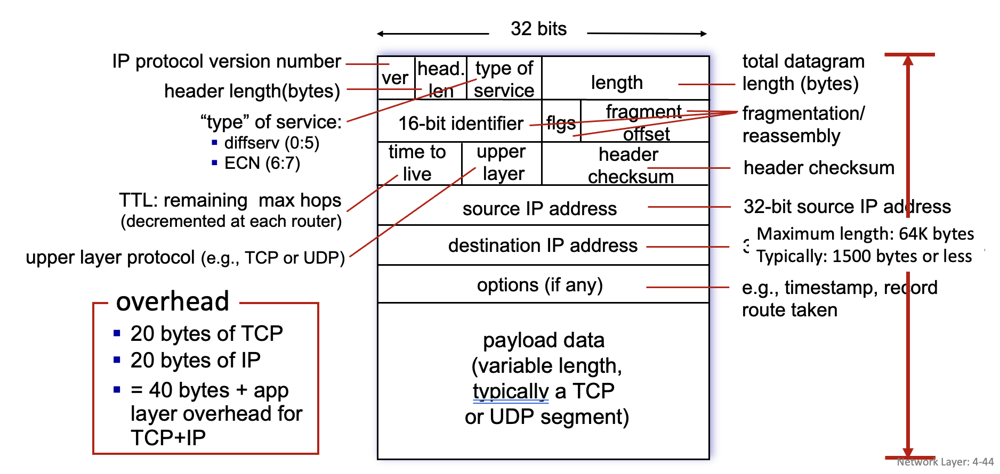
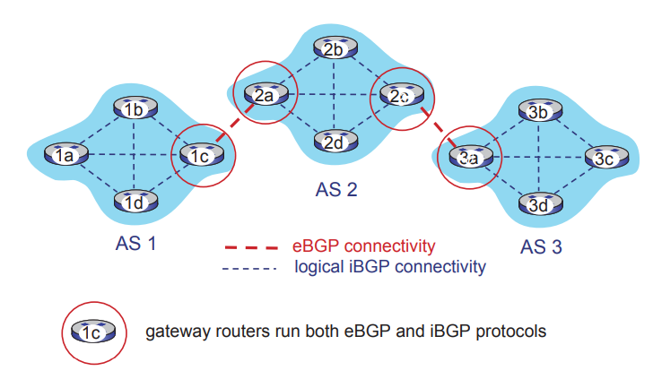

:::info
三上修了計算機網路，但上了兩個星期覺得好像有點聽得懂又有點混亂，所以決定寫個筆記讀懂它。希望可以堅持寫完XD
:::

<!-- more -->

## Computer Networks and the Internet

**網際網路 Internet** 是一個 **「網路的網路」**，由許多較小的**網路 (network)** ，像是家庭網路、企業網路和移動網路等組成一個大網路。這些網路透過不同的通訊技術（如光纖、無線電波、銅線）相互連結，並使用協定（protocols）的標準化規則來確保資料在網路之間能夠順利傳輸。

**協定（Protocol）** 是指一組用來管理數位裝置之間如何交換資料的規則和標準。
> Protocols define the format, order of messages sent and received among network entities, and actions taken on message transmission, receipt.

協定定義了網路實體之間發送和接收訊息的格式、順序以及訊息傳輸、接收所採取的操作。就像人類的語言一樣，我問了「今天天氣如何」，對方就會回答「今天是晴天」之類的，不會回答「我早上吃了一個蛋餅」，能有一個正常順暢、大家都能懂的溝通方式。

## 網路架構

網路架構由**網路邊緣（Network Edge）**、**網路核心（Network Core）**、**網路接入（Access Networks）和實體媒介（Physical Media）** 組成。


### Network Edge

Network Edge 故名思意就是網路的外圍部分，由終端設備（Hosts）組成，這些設備是用來生成和接收資料的，再通過各種網路技術來訪問 Network Core。Hosts可以分為兩種：

1. **客戶端設備（Clients）**：例如個人電腦、智慧手機、平板等，這些設備用來向伺服器發送請求。
2. **伺服器（Servers）**：通常位於資料中心（Data Center），負責回應客戶端的請求，提供所需的資料或服務。

### Access Networks and Physical Media

Access Networks 是指 hosts 以什麼通訊方式連接到 network core。Access Networks 可以分為三種：

1. 住宅接入網路（Residential Access Networks）：家庭用戶通過這類接入網路連接到網路服務提供商（ISP）。
2. 機構接入網路（Institutional Access Networks）：企業、學校等機構使用的接入網路，這類網路通常混合使用有線和無線技術。
3. 移動接入網路（Mobile Access Networks）：移動設備如手機通過無線技術接入網路（如WiFi、4G/5G）。

Access Networks 的主要技術有幾種：

- 有線接入技術
    - 電纜寬頻接入 (cable-based access)：通過混合光纖與同軸電纜（Hybrid Fiber Coax, HFC），下載速度可達 40 Mbps 至 1.2 Gbps，上傳速度 30-100 Mbps。
    - DSL (Digital Subscriber Line)：用家用電話線將資料連至網路。下載速度通常為 24-52 Mbps，上傳速度為 3.5-16 Mbps。
- 無線接入技術
    - Wi-Fi
    - 4G/5G 移動網路
    - 藍牙（Bluetooth) 
    - 衛星網路


### Network Core

Network Core 就是網路的「中樞」，負責在不同的 hosts 之間進行資料的傳遞和路由選擇。network core 的主要目的是傳輸資料 (Packet-switching)，通過多個相互連接的**路由器 (router)** 和 **交換機 (switch)**，將資料包從來源到目的地的傳輸過程。兩個Network Core的主要工作：

- **Routing**: Routing 就是路由器 router 的工作，是一個 global 的操作。根據封包的 ip 位置，通過 routing algorithms 來決定資料包應該通過哪條路徑到達目標網路。
- **Switching ( Forwarding )** : Switching 是交換機 switch的工作，是一個 local 的操作，在同一個網路內，根據封包的目標MAC地址，將資料傳送到正確的裝置。

**封包交換 Packet-switching**

- Store and Forward: 資料在傳輸時，整個封包必須全部傳到路由器，才能被傳送到下一個網路。所以在封包還沒全部傳到路由器前，先到的資料就會被存在路由器裡。在這個傳輸的過程所需要的時間就稱 packet transmission delay，one-hop transmission delay = L-bits \ R-bps

-  Queuing and Loss： 當資料到達的速度（位元/秒）超過傳輸速率時，封包就要排隊等待被轉發。如果排隊的封包太多，超過 router 的記憶體容量，封包就會 loss，無法傳到目的地。

**電路交換 circuit switching**

封包交換的替代方案，就是**電路交換 circuit switching**，它的方法是在兩個端點之間預留專用的資源來建立連接，在傳輸的過程中，這些資源是專用的，並且不會與其他連接共享。電路交換有兩種：
1. Frequency Division Multiplexing (FDM, 分頻多工): 根據頻率分割給不同的使用者通訊。

2. Time Division Multiplexing (TDM，分時多工): 根據時間分割給不同的使用者通訊。


**Packet switching v.s circuit switching**

| 特性                         | **封包交換（Packet Switching）**        | **電路交換（Circuit Switching）**       |
|------------------------------|--------------------------------------|--------------------------------------|
| **資源利用**                  | 資源動態分配，可共享                  | 資源專用，不共享                      |
| **路徑選擇**                  | 動態選擇路徑，每個封包可走不同路徑        | 固定路徑，需在通訊前建立端到端路徑      |
| **延遲與丟包**                | 可能有延遲，排隊時封包可能被丟棄         | 延遲低且無封包丟失           |
| **資源利用效率**              | 利用率高，因為資源按需使用           | 利用率低，未使用的資源會閒置        |
| **適用場景**                  | 突發性資料流，如網頁請求、電子郵件        | 連續資料流，如語音通話、視頻會議        |
| **應用**                  | 網際網路、數據網路                      | 傳統電話網路                         |


## 網路性能

網路性能（performance）的三個關鍵指標是：**loss（資料丟失）**、**delay（延遲）**、和**throughput（吞吐量）**。

1. **Loss** 是指在網路傳輸過程中，因為網路擁塞（queuing）會導致過多的封包，超出路由器或交換機的緩衝區極限，無法再存儲新的封包，封包會被丟棄，使得部分封包無法被傳送到目標。
2. **Delay** 是指資料從來源設備傳送到目的地所花費的時間，也稱為**total nodal delay**，通常分為4種：
    - **處理延遲（Processing Delay）**：路由器或交換機處理每個封包所需的時間，包括檢查錯誤和決定封包傳輸路徑。
    - **排隊延遲（Processing Delay）**：當封包到達路由器或交換機時，若已有其他封包在等待傳輸，封包將會在緩衝區中排隊，這導致了排隊延遲。排隊時間取決於網路的擁塞程度。
    - **傳輸延遲（Transmission Delay）**：傳送封包到鏈路上所需的時間。Transmission Delay = file size (L，bytes) / transmission rate (R，bytes/s)
    - **傳播延遲（Propagation Delay）**：封包在物理媒介上傳播的時間，取決於媒介的長度和訊號的傳播速度。較長的物理距離會導致較大的傳播延遲。Propagation Delay (s) = distence (m)/ propagation speed (m/s)
> total nodal delay = Processing Delay + Processing Delay + Transmission Delay + Propagation Delay
3. **Throughput** 是指在特定時間內，從來源到目的地傳輸的資料量，通常以位元/秒（bps）為單位。可以分為**瞬時吞吐量（Instantaneous Throughput）** 和 **平均吞吐量（Average Throughput）**。影響吞吐量的因素如**瓶頸鏈路（bottleneck link）** ，封包傳輸路徑中最慢的鏈路決定了整個網路的吞吐量。如果某條鏈路的速率低於其他部分，整個資料流將被限制在這條鏈路的傳輸速率之內。


我們可以用`traceroute`指令去查看一個網域的路徑、延遲和資料丟失的情況。
```
❯ traceroute ncueeclass.ncu.edu.tw
traceroute to ncueeclass.ncu.edu.tw (140.115.197.25), 64 hops max, 40 byte packets
 1  172.20.10.1 (172.20.10.1)  12.317 ms  3.992 ms  3.833 ms
 2  10.157.65.134 (10.157.65.134)  25.604 ms  179.198 ms  197.686 ms
 3  10.157.65.41 (10.157.65.41)  22.517 ms
    10.157.65.45 (10.157.65.45)  19.483 ms
    10.157.65.41 (10.157.65.41)  18.991 ms
 4  10.157.67.178 (10.157.67.178)  20.577 ms  17.749 ms  20.664 ms
 5  210-65-126-214.tylc-3336.hinet.net (210.65.126.214)  20.589 ms  19.209 ms  19.124 ms
 6  220-128-8-26.tyfo-3031.hinet.net (220.128.8.26)  19.845 ms
    220-128-9-190.tylc-3032.hinet.net (220.128.9.190)  23.144 ms
    220-128-8-22.tyfo-3031.hinet.net (220.128.8.22)  24.430 ms
 7  220-128-8-225.tyfo-3331.hinet.net (220.128.8.225)  22.901 ms
    220-128-8-141.tyfo-3331.hinet.net (220.128.8.141)  27.973 ms
    220-128-8-153.tyfo-3331.hinet.net (220.128.8.153)  23.176 ms
 8  211-22-39-249.tyfo-4901.hinet.net (211.22.39.249)  32.296 ms  20.075 ms  19.104 ms
 9  203-75-135-45.hinet-ip.hinet.net (203.75.135.45)  21.739 ms  1029.704 ms
    61-222-83-105.hinet-ip.hinet.net (61.222.83.105)  23.600 ms
10  203.72.244.142 (203.72.244.142)  20.711 ms
    coreswitch.ncu.edu.tw (203.72.244.236)  43.346 ms  20.975 ms
11  * * 203.72.244.186 (203.72.244.186)  46.478 ms
12  * * *
13  * * *
14  * * *
15  * * *
```

## OSI and TCP/IP

網路最早的參考模型是 OSI 七層協定，後來才開發出 TCP/IP 的四層協定。不過目前世界上還是多以 OSI 七層協定來定義網際網路的分層概念

OSI 七層協定從底層到上層分別是「實體層、資料鏈結層、網路層、傳輸層、會談層、表現層與應用層」：


因為 OSI 七層協定規範的太嚴謹，後來美國軍方與柏克萊大學合作，開發了一個當時給學術單位使用的網路程式，後來被稱為 TCP/IP 協定，俗稱 Internet。


分層的好處在於模組化，可以抽換程式碼，越接近硬體的階層為底層(layer 1)，越接近應用程式的則是高層(layer 7)。 不論是接收端還是發送端，每個一階層只認識對方的同一階層資料：

<!-- <div align="center">
  
</div> -->


因此應用程式在傳封包時，封包經過每一個階層時便會附加該階層的資訊，依序一直放到第一層內變成很大一包，傳給對方後再從第一層開始慢慢拆開。

### 五層網路協定模型 (TCP/IP)
1. **應用層（Application Layer）**：提供應用程式之間的網路服務，支持應用層協定（如HTTP、SMTP、DNS等），這些協定定義了應用程式如何與網路進行互動。
2. **傳輸層（Transport Layer）**：負責應用程式之間的**數據傳輸**，並確保資料的可靠性（如TCP）或快速傳輸（如UDP）。TCP（傳輸控制協定）提供可靠的資料傳輸和錯誤檢測，而UDP（用戶數據報協定）則提供較少的控制但具有更快的傳輸速度。
3. **網路層（Network Layer）**：負責將資料從源設備路由到目的設備，根據目標IP地址來決定數據包的傳輸路徑。IP協定是網路層的核心協定，負責封包的路由選擇與轉發。
4. **資料鏈路層（Link Layer）**：負責相鄰設備之間的數據傳輸，並控制物理網路上資料的發送與接收，還包括錯誤檢測與資料流控制。
5. **物理層（Physical Layer）**：處理 bits 在物理媒介中的傳輸，涉及信號的編碼和物理傳輸介質（如銅線、光纖、無線電波等）。


## Application Layer

網路應用程式的基本原則與概念，涵蓋了應用層協議的設計及實施的關鍵方面。

- 訊息的類型：定義訊息的交換類型，例如請求（request）、回應（response）。
- 訊息語法：訊息格式和欄位如何劃分，定義了訊息應包含哪些欄位。
- 訊息語義：欄位內資訊的意義，也就是欄位中的資料所代表的內容。
- 訊息傳輸規則：什麼時候及如何在應用程式之間發送和回應訊息的規則。

**Client-Server Paradigm:** Server通常是持續運行的主機，Client與伺服器進行通訊，彼此之間不直接通訊。例子包括HTTP、IMAP、FTP等。
**Peer-to-peer (P2P) Paradigm:** 沒有固定的伺服器，節點之間直接通訊，彼此提供服務。這種架構具有自我擴展性，新的節點帶來新的服務能力和需求，但管理較為複雜，典型應用包括BitTorrent等。
<!--  -->


應用程式對傳輸層服務的需求主要有以下幾個方面：

- 數據完整性（Data Integrity）：有些應用程式（如檔案傳輸、網頁交易）需要100%可靠的數據傳輸。
- 時延需求（Timing Requirements）：某些應用（如網路電話、互動遊戲）需要低時延才能有效運作。
- 吞吐量（Throughput）：多媒體應用通常需要最低的吞吐量保證，而其他應用則較為彈性，能利用任意可用的帶寬。
- 安全性（Security）：應用程式可能需要加密和數據完整性驗證。

**Internet applications, and transport protocols**

| application            | application protocol     | transport protocol |
| ---------------------- | ------------------------ | ------------------ |
| file transfer/download | FTP                      | TCP                |
| e-mail                 | SMTP                     | TCP                |
| Web documents          | HTTP                     | TCP                |
| streaming audio/video  | SIP, RTP, or proprietary | TCP or UDP         |
| Internet telephony     | HTTP, DASH               | TCP or UDP         |
| interactive games      | WOW, FPS (proprietary)   | TCP                |


### Web and HTTP

**HTTP（Hypertext Transfer Protocol）** 是網頁的應用層協議，用於瀏覽器與網頁伺服器之間的通訊，使用Client-Server model。客戶端是瀏覽器，發送HTTP request 並顯示收到的網頁內容；伺服器是網頁伺服器，接收請求並回應相應的內容。HTTP是無狀態的（Stateless Protocol），即伺服器不會記住之前客戶端的請求狀態。每個請求都是獨立的。

HTTP 連接 TCP 有兩種類型：
1. 非持久性HTTP（Non-Persistent HTTP）：
每次請求/回應都需要建立一個單獨的TCP連接。一個連接只傳送一個物件，然後關閉，導致需要多次連接才能加載完整的網頁。使得有N個物件要轉送時需要n個RTT。
2. 持久性HTTP（Persistent HTTP）：
同一個TCP連接可以用來傳送多個物件，減少建立連接的開銷。瀏覽器能夠並行處理資源的請求，從而縮短RTT。

#### HTTP request and response message form


#### HTTP request method
HTTP中定義了不同的請求方法(Request Method)。並且，HTTP其中的一個設計目標為
>分離「資源辨識 (resource identification) 」與「請求語意(request semantics) 」。其中的請求語意便是HTTP所定義的請求方法所要規範的部分。

而請求方法的設計含意便是：由客戶端(client)發出請求的目的(purpose)與期望伺服器(server)所回傳的結果。它們中的每一個實現了不同的語義，但它們的一組常見特徵是共享的：例如，一個請求方法可以是安全（Safe）、冪等（Idempotent）或可緩存（Cacheable）的。
1. `GET` 方法請求指定資源的表示。使用 GET 的請求只應檢索數據。
2. `HEAD` 方法要求與 GET 請求完全相同的回應，但不包括回應主體。
3. `POST` 方法將實體提交給指定的資源，通常導致狀態的變化或伺服器上的副作用。
4. `PUT` 方法用請求載荷替換目標資源的所有當前表示。
5. `DELETE` 方法刪除指定的資源。
6. `CONNECT` 方法與目標資源識別的伺服器建立隧道。
7. `OPTIONS` 方法描述目標資源的通信選項。
8. `TRACE` 方法在到目標資源的路徑上執行消息回送測試。
9. `PATCH` 方法對資源應用部分修改。

#### HTTP response status codes
- 200 OK：請求成功，伺服器回應所需的資源。
- 301 Moved Permanently：資源已永久移動，新的位置在回應中指定。
- 400 Bad Request：請求格式錯誤，伺服器無法理解。
- 404 Not Found：請求的資源未找到。
- 505 HTTP Version Not Supported：伺服器不支持請求使用的HTTP版本。

#### Cookies

Cookies 是用來在瀏覽器和伺服器之間維持狀態的文字檔案。由於HTTP協議是無狀態的，每次請求都是獨立的，伺服器無法記住用戶的之前請求。因此 Cookies 被用來在不同的請求之間保留狀態信息，追蹤、個人化和保存關於每個使用者會話（session）的資訊，就是瀏覽的行為。

**cookies 的四個組成部分：**
1. HTTP response 的cookie header
2. 下一個 HTTP request 中的cookie header
3. 儲存在 host 的cookie文件，由使用者的瀏覽器管理
4. 後端資料庫

**cookies 的運作方式：**
當 client 第一次訪問網站時，伺服器在 HTTP response 中給一個 `Set-Cookie` 標頭，發送給用戶瀏覽器。該 Cookie 包含一個唯一的ID（例如userID=12345）。瀏覽器將這個 Cookie 儲存在用戶瀏覽器上。當用戶再次訪問同一網站時，瀏覽器會在 HTTP request 中自動附帶該網站的Cookie，讓伺服器可以識別用戶。伺服器根據收到的Cookie來查看用戶的信息或數據，從而提供個性化的服務。


#### Web caches, Proxy Server

**Web Cache（網頁快取）** 是一種中介設備，位於用戶和原始伺服器之間，負責存儲常請求的網頁內容。當用戶請求已快取的內容時，Web Cache可以直接提供資源，而無需訪問原始伺服器。可以減少客戶端的請求延遲和減輕原始伺服器的負擔，提升整體網路效能。

**Proxy Server（代理伺服器）** 是作為用戶端和伺服器之間的中介，扮演著Web Cache的角色。對用戶來說，代理伺服器就像一個伺服器，提供快取的內容；對原始伺服器來說，它像一個用戶端，請求並存儲所需的內容。Proxy Server的另一重要作用是提高網絡安全性和隱私性，通過屏蔽用戶的實際IP地址。


#### HTTP/2, HTTP/3

HTTP/2 於 2015 年發布，主要是在提升多物件請求的性能，減少延遲，改善 HTTP 1.1 中無法有效處理大量並行請求的限制。

HTTP/2 的主要特性：
- 多路複用：同一連接中可並行處理多個請求和回應，消除「隊頭阻塞」（head-of-line (HOL) blocking），避免小物件等待大物件完成傳輸。
- 數據分幀：HTTP/2將傳輸的數據分為多個幀，每個幀可包含不同請求的數據，實現交錯傳輸，使客戶端更快獲取到不同內容。
- 伺服器推送：伺服器可以主動向客戶端發送相關資源（如圖片、樣式表等），無需等待客戶端請求，減少回應時間。
- 優先級控制：客戶端可設定不同資源的優先級，伺服器依優先級順序回應，提升重要資源的載入速度。


HTTP/3 是基於UDP的協議，旨在解決TCP協議引起的延遲問題，並增加安全性和容錯性。

HTTP/3 的主要特性：
- QUIC ( Quick UDP Internet Connections ) 協議：HTTP/3基於QUIC協議，將多個物件傳輸放在單個UDP連接內，但每個請求獨立處理，避免TCP的「隊頭阻塞」問題。
- 更快的連接建立：相比於TCP的三次握手，QUIC僅需一次握手即可建立安全連接，縮短首次連接的延遲。
- 內建加密：QUIC協議內建TLS加密層，增加傳輸的安全性，無需額外協商。
- 容錯性強：QUIC的設計讓數據丟包不會影響整體連接，傳輸更加穩定，適用於高流量或不穩定網絡環境。


### E-mail, SMTP, IMAP

電子郵件系統的三個主要組成部分：
1. 用戶代理（User Agent, UA）：用來編寫、讀取、編輯郵件的軟件或應用程序，如Outlook或Gmail。它負責將郵件發送至郵件伺服器並從伺服器中接收郵件。
2. 郵件伺服器（Mail Server）：用於存儲用戶的郵件。每個用戶在郵件伺服器上都有一個信箱，用來接收和保存傳入的郵件。郵件伺服器同時也保存將要發送的郵件。
3. 簡單郵件傳輸協議（Simple Mail Transfer Protocol, SMTP）：這是一種應用層協議，負責郵件在郵件伺服器之間的傳輸。它使用TCP協議來保證數據的可靠傳送。


#### 運作方式：
1. Headshaking: 用戶端傳送「telnet 《mail_server》 25」與伺服器端連線。
2. 伺服器端回傳220訊息。
3. 用戶端傳送「Hello 《Client》」告訴伺服器端client是誰。
4. 伺服器端回傳250訊息。
5. 建立連線完成，以下傳送訊息：
    - 用戶端傳送「MAIL FROM:《E-Mail Address》」，告知來源。
    - 伺服器回傳250代表OK，550代表錯誤。
    - 用戶端傳送「RCPT TO:《E-Mail Address》」，告知目的地。
    - 伺服器回傳250代表OK，550代表錯誤。
    - 用戶端傳送「DATA」指令，告知接下來要傳送Header和Body了。
    - 伺服器回傳一個 354 的訊息，並且提及以「(換行).(換行)」作為郵件內容的結尾。
    - 用戶端傳送Header與Body內容，最後以「(換行).(換行)」為結尾。
    - 伺服器回傳250代表寄信成功。
6. 用戶端傳送「QUIT」結束連線。

#### IMAP：郵件存取協議（Internet Mail Access Protocol）
IMAP 是用來從郵件伺服器上檢索郵件的協議。與SMTP不同，IMAP主要用於讀取和管理存儲在伺服器上的郵件，而不是傳輸郵件。IMAP提供了保留郵件在伺服器上，可以在伺服器上創建和管理資料夾來組織郵件。

#### Mail message format


### The Domain Name System (DNS)
DNS（Domain Name System） 是網際網路上用來將人類可讀的域名(hostname)轉換成電腦可理解的IP地址的系統。DNS採用 **分佈式(distributed)** 的方式來管理網路上的域名，避免單點失效和流量過載等問題。

#### DNS 階層架構
1. 根域名伺服器（Root DNS Servers）：位於DNS層次結構的頂端，負責指向頂級域名伺服器（如 `.com`、`.org` 等）。
2. 頂級域名伺服器（Top-Level Domain Servers, TLDs）：負責管理各自頂級域的域名解析，如 `.com`、`.org`、`.edu`、國家域名如 `.cn`、`.uk`等。
3. 權威域名伺服器（Authoritative DNS Servers）：由各個組織運營，提供域名和IP地址的最終解析，例如 `example.com` 的權威伺服器能夠提供` www.example.com`的IP地址。

#### DNS查詢過程
- 迭代查詢（Iterative Query）：DNS客戶端發送請求給本地DNS伺服器，本地伺服器若無法解析，會返回下一個應詢問的伺服器地址，直到獲得最終結果。
- 遞迴查詢（Recursive Query）：本地DNS伺服器代表客戶端進行完整的解析，自己詢問所有必要的DNS伺服器，然後將最終結果返回給客戶端。


**DNS緩存（Caching）**

DNS 伺服器會將解析結果緩存一段時間（TTL，Time To Live），之後如果有查詢同一個 ip 就不用再重新查詢，以提高查詢效率和減少伺服器負載。緩存的解析結果會在 IP 地址更改後失效。

#### DNS資源記錄（Resource Records, RR）

DNS 資源記錄 是DNS數據庫中存儲的記錄，用於域名和其他信息的映射。每個記錄的格式是 (name, value, type, ttl)，常見的記錄類型包括：
- `type=A`：將域名對應到IP地址。`name`是域名，`value`是IP地址。
- `type=NS`：指定該域名的權威DNS伺服器。`name` is domain (如 foo.com)，`value`是權威DNS伺服器的域名。
- `type=CNAME`：將域名指向另一個別名域名。`name`是某些「規範」的別名，`value`是規範名稱。如`www.ibm.com` 其實是 `servereast.backup2.ibm.com`。
- `type=MX`：指定處理該域名郵件的郵件伺服器。

#### DNS protocol messages

- Header
    - identification：16 bits，用於查詢、回覆查詢，對於每一個 # 
    - flags：query or reply, recursion desired or recursion available, reply is authoritative or not.
- Question：包含要查詢的域名和查詢類型。
- Answer：包含響應的資源記錄，提供了查詢結果。
- Authority：指出哪個伺服器是此查詢的權威伺服器。
- Additional Information：可選的額外數據，如IP地址。


### video streaming and content distribution networks (CDN)

隨著影音內容的流行，尤其是像Netflix、YouTube等平台，每天都有數以百萬的用戶同時訪問，而且不同用戶具有不同的設備和網絡頻寬，因此串流必須處理如此大量的影音傳輸，適應不同的頻寬和設備。所以需要設計**分散式**的架構和應用層的架構來解決這些問題。

影片是由一系列圖像（每秒24或30張）組成，數位圖像由像素陣列構成，每個像素由位元來表示，所以可以透過編碼來減少需要傳輸的資料大小。下面是編碼轉輸的方法：
- **空間壓縮**（Spatial Coding）：壓縮每個畫面內的冗餘信息。例如，重複的像素顏色值可以用顏色和重複次數來代替。
- **時間壓縮**（Temporal Coding）：只傳送與前一個畫面不同的部分，而不是每一幀畫面都完整傳輸。
- **固定比特率（constant bit rate，CBR）**：每秒傳輸的比特數固定，不論畫面複雜度如何。
- **可變比特率（variable bit rate，VBR）**：根據畫面的複雜度動態調整比特率，複雜的畫面使用較高的比特率，簡單的畫面使用較低的比特率。

#### 串流影音的類型
- **串流儲存影片（Streaming Stored Video）**：影音已經被預先錄製和編碼，存儲在伺服器上，用戶可以隨時訪問。例如，Netflix和YouTube的影片。這類型的串流會遇到幾個問題：
    - 連續播放限制：在客戶端播放視頻時，播放時間必須與原始時間一致。但由於網絡延遲不穩定，因此需要在客戶端設置緩衝區以保持連續播放的穩定性。
    - 客戶端交互性：使用者可能需要暫停、快進、倒帶或跳至其他視頻片段，這對播放的穩定性提出更高要求。
    - 封包的丟失與重傳
- **實時視頻串流（Live Streaming）**：用戶實時觀看正在發生的事件（如體育比賽、新聞直播）。與預錄視頻不同，實時串流要求更低的延遲。

#### DASH 動態自適應串流（Dynamic Adaptive Streaming over HTTP）

影音檔案被分割成多個區塊（chunks），每個塊可以以不同的比特率編碼和儲存在伺服器上，在各個 CDN 節點中存入複製的檔案，並提供不同區塊的 URL。客戶端會定期檢查頻寬，根據當前的網路頻寬動態選擇適合的編碼版本下載並播放，且一次請求下載一整個區塊存在client的buffer，以降低延遲和同步的問題，確保影片播放的流暢性。

> **Streaming video = encoding + DASH + playout buffering**
> 
#### 內容傳遞網絡（CDNs）
內容傳遞網路（Content Delivery Network or Content Distribution Network）是分佈在多個地理位置的伺服器組成的網路，用來加速內容傳輸，尤其是大流量的視頻和多媒體文件。減少響應時間、降低網路負載，通過將內容放置在離用戶較近的伺服器上來達到更快的響應速度。

**CDN的兩種架構**
1. **Enter Deep CDN**：將CDN伺服器深入部署到多個接入網絡中，靠近用戶端以減少延遲。Akamai是一個典型的例子，擁有數十萬台伺服器遍布全球。
2. **Bring Home CDN**：將較少數量的大型伺服器集群放置於接入網絡附近的互聯網交換點（POPs）。

#### OTT（Over-The-Top）傳輸的挑戰
- **OTT 內容傳輸**（Over-The-Top）：指通過互聯網直接向用戶傳輸媒體內容（如Netflix），而不依賴傳統的有線或衛星電視基礎設施。OTT傳輸面臨如何在擁擠的互聯網上保障高效、順暢內容傳輸的挑戰。
- **CDN 優化策略**：CDN不僅需要考慮將哪些內容放在什麼位置，還需考慮在不同網絡情況下，選擇從哪個伺服器、以什麼速率向用戶傳輸內容。

### P2P applications

Peer-to-peer (P2P) 與傳統的 Client-Server 架構不同，P2P架構不依賴於一個永遠在線的中央伺服器。任意節點之間可以直接進行通訊。而且 P2P 網路可以自我擴展，新的節點不僅能帶來更多服務需求，還能增加新的服務能力。P2P系統中的節點可以隨時上下線，可能動態更改IP地址，因此需要較為複雜的管理系統來跟蹤這些變化。

**BitTorrent：P2P file distribution**

> Torrent: group of peers exchanging chunks of a file

<small style="color: red"></small>

BitTorrent 是 P2P 文件共享的典型例子。BitTorrent 的主要元素：
- 文件分塊（Chunks）：在BitTorrent中，文件被分成小塊（Chunks，通常為256KB），這使得用戶可以同時從多個來源下載不同的 chunks，以提高下載效率。
- Tracker：追蹤伺服器（Tracker）負責追蹤參與下載和上傳該文件的用戶列表，並幫助新加入的用戶找到可以連接的節點（其他用戶）。
- Tit-for-tat機制：為了防止用戶只下載不上傳，BitTorrent實行一種互惠機制，節點之間優先給予對方文件上傳速度更快的節點分享數據。

**運作流程**
- 加入與下載：當用戶加入一個torrent時，會先向Tracker請求當前活躍節點的列表，然後開始與這些節點交換文件塊。
- 選擇性下載（Rarest First）：BitTorrent中的下載機制傾向於優先請求網路上較少的 chunks，這樣可以確保稀有的 chunks 在網路上被更快傳播，防止文件丟失。
- 隨機優選（Optimistic Unchoking）：為了避免只與少數節點分享數據，BitTorrent會定期隨機選擇一些節點提供文件塊，即使這些節點未提供數據回饋。

### socket programming with UDP and TCP

#### Socket 的概念
- **Socket** 是應用程式和網路之間的接口，允許應用程序透過網絡傳送數據。
  - **應用程式控制**：開發者控制應用層和傳輸層之間的通信。
  - **操作系統控制**：傳輸層及以下的網絡通信部分由操作系統管理。
  - Socket 可以理解為應用程序的門戶，數據進出網絡都是通過這個“門”完成的。

**兩種主要的Socket類型**
- **UDP Socket**：適用於基於無連接、資料報的通信。
- **TCP Socket**：適用於可靠的、基於連接的流式數據傳輸。


#### UDP Socket 
**UDP的特點**
- **無連接（Connectionless）**：UDP無需在發送數據前建立連接，也無需結束連接。數據報會被直接發送到接收方。
- **不可靠傳輸**：UDP不能保證數據是否會送達或按順序到達，數據可能丟失或重複。
- **無流控與擁塞控制**：UDP不提供流量控制和擁塞控制，因此更適合於實時應用，如視頻通話、遊戲等，這些應用能夠容忍一定的數據丟失。

**UDP client-server programming**
- **UDP client**：
  1. 創建一個UDP socket。
  2. 構建並發送數據報，指定伺服器的 IP 和 port。
  3. 接收來自伺服器的回應（數據報）。
  4. 關閉socket。
  
  ```python
  from socket import *
  clientSocket = socket(AF_INET, SOCK_DGRAM)
  clientSocket.sendto(message.encode(), (serverName, serverPort))
  modifiedMessage, serverAddress = clientSocket.recvfrom(2048)
  clientSocket.close()
  ```

- **UDP server**：
  1. 創建一個UDP socket，並綁定到指定的 port。
  2. 持續監聽並接收來自客戶端的數據報。
  3. 處理數據並將結果回傳給客戶端。
  4. （可選）根據需要關閉 socket。
  
  ```python
  from socket import *
  serverSocket = socket(AF_INET, SOCK_DGRAM)
  serverSocket.bind(('', serverPort))
  while True:
      message, clientAddress = serverSocket.recvfrom(2048)
      modifiedMessage = message.decode().upper()
      serverSocket.sendto(modifiedMessage.encode(), clientAddress)
  ```

#### TCP Socket 

**TCP的特點**
- **連接導向（Connection-oriented）**：TCP在傳輸數據之前需要建立一個連接，並且在數據傳輸完成後需要關閉連接。這保證了數據的可靠傳輸。
- **可靠傳輸**：TCP提供數據的確認機制，確保數據不會丟失、重複或亂序。TCP還包含流量控制和擁塞控制。
- **字節流（Byte Stream）**：TCP數據以連續的字節流形式發送，沒有數據邊界。

**TCP client-server programming**
- **TCP client**：
  1. 創建一個TCP socket。
  2. 使用伺服器的IP地址和端口號建立TCP連接。
  3. 發送 request 到伺服器，並接收伺服器的回應。
  4. 關閉 socket，結束連接。
  
  ```python
  from socket import *
  clientSocket = socket(AF_INET, SOCK_STREAM)
  clientSocket.connect((serverName, serverPort))
  clientSocket.send(sentence.encode())
  modifiedSentence = clientSocket.recv(1024)
  clientSocket.close()
  ```

- **TCP server**：
  1. 創建一個TCP socket，並綁定到指定的 port。
  2. 開始監聽來自客戶端的連接請求。
  3. 接受客戶端的連接，並為每個連接創建一個新的套接字。
  4. 接收來自客戶端的數據，進行處理，並將結果回傳。
  5. 關閉該連接的socket。
  
  ```python
  from socket import *
  serverSocket = socket(AF_INET, SOCK_STREAM)
  serverSocket.bind(('', serverPort))
  serverSocket.listen(1)
  while True:
      connectionSocket, addr = serverSocket.accept()
      sentence = connectionSocket.recv(1024).decode()
      capitalizedSentence = sentence.upper()
      connectionSocket.send(capitalizedSentence.encode())
      connectionSocket.close()
  ```

#### Socket socket 的關鍵概念
- **超時處理（Timeout Handling）**：在進行網絡通信時，可能會發生延遲或無法接收到數據，這時可設置套接字的超時時間。Python可以使用 `settimeout()` 方法來設置超時。
  
  ```python
  s.settimeout(30)  # 設定超時時間為30秒
  ```

- **異常處理**：通過 `try-except` 結構來捕捉和處理網絡通信中的異常情況，如超時或連接失敗。

  ```python
  try:
      # 嘗試接收數據
  except timeout:
      # 處理超時情況
  ```

## Transport Layer

傳輸層提供 application process 之間的邏輯通信，讓運行於不同 hosts 上的應用可以互相通信。傳輸層的發送端將應用層資料分解為較小的數據段(segments)，並傳遞給網路層；傳輸層的接收端會重新組裝接收到的數據段並上傳給應用層。傳輸層是負責 process 之間的通信，而網路層則提供主機之間的通信服務。

傳輸層的主要協議
- **TCP（Transmission Control Protocol）**：是一種連接導向的可靠傳輸協議，負責順序傳遞、擁塞控制和流量控制等。
- **UDP（User Datagram Protocol）**：提供無連接的不可靠傳輸，數據傳輸無需確認，適合對時延敏感但可容忍丟包的應用，例如多媒體應用。

### Multiplexing and demultiplexing

**發送端的多路複用 (multiplexing)**：傳輸層在數據段中加入header（如 source port 和 destination port），標示datagram 的來源應用，然後封裝成 segments。這樣即使多個應用同時運行，傳輸層也可以根據這些 port 為每個應用分配獨立的數據流。

**接收端的分解 (demultiplexing)**：當傳輸層接收到 datagram 後，會根據 destination port 來判斷應將 datagram 傳遞給哪個應用進程。


#### Demultiplexing of UDP and TCP 

- UDP (Connectionless demultiplexing)：無連接的分解方式僅依賴 dest port，應用程式可以使用同一個 socket 接收 datagram，datagram 可能會被重新排列，適合要求不高但快速傳輸的應用。
- TCP (Connection-oriented demultiplexing)：需要依賴 source IP、source port、dest IP、dest port 進行可靠分解，不同的 IP 和 port 需要用不同的 socket，確保 datagram 的正確順序。


### UDP

UDP 是一種輕量級的**無連接**（connectionless）傳輸層協議，不需要建立和維護連接狀態。提供最簡單的 best-effort 傳輸，不保證 datagram 的交付、順序和可靠性，因此數據可能會丟失或到達順序錯亂，如果檢查發現 datagram 已損壞， datagram 將被丟棄。由於 UDP 沒有擁塞控制機制，它可以以最大速率發送數據，適合對速度要求高且容錯性強的應用。

#### UDP segment header


#### UDP checksum

**發送端**
- 將 UDP segment 的內容（包括 UDP header 和 IP）視為 16 位整數序列。
- 對 segment 的內容進行**一補數**求和得到 checksum。（進位時，進位多出的部份會截斷並加到原本的和，最後再取總和的or）
- 將 checksum 的值填入 UDP header 的 checksum 欄位。

**接收端**
- 重新計算接收到的 segment 的 checksum。
- 檢查計算出的 checksum 是否與 segment 中的 checksum 一樣。如果不相等，表示檢測到錯誤；如果相等，表示未檢測到錯誤。


### Principles of reliable data transfer (rdt)

Complexity of reliable data transfer protocol will depend (strongly) on characteristics of unreliable channel (lose, corrupt, reorder data?)


#### 協議的演進（RDT 協議系列）
- **rdt1.0**：假設通道完全可靠，無 bit error、loss of packets，無需錯誤檢測，直接傳輸數據。
- **rdt2.0**：假設通道有 bits error，使用 ACK 和 NAK 來確認數據的正確性。
    - acknowledgements (ACKs): receiver explicitly tells sender that packet received OK
    - negative acknowledgements (NAKs): receiver explicitly tells sender that packet had errors
    - 使用 checksum 檢查封包是否有 bit error。
    - stop and wait：sender 傳送一個資料包，然後等待 reciever 的 response。
    - 當 sender 收到 NAK 時會重傳。
- **rdt2.1**：處理 ACK/NAK 損壞 (garbled、corrupted) 的情況。
    - 如果ACK/NAK損壞了，傳送端會重新傳送封包。
    - 傳送端會在每個封包加上 sequence number。
    - 接受端會刪掉重複 (duplicate) 傳遞的封包。
- **rdt2.2**：NAK-free protocol。
    - 和 rdt2.1 的功能一樣，但只使用 ACK
    - 接收者傳送 ACK 如果上一個 packet 是正確的。
    - 如果 sender 重複收到 ACK 則視為 NAK，重傳封包。
- **rdt3.0**：考慮通道有 bit error and loss of packet。
    - 引入超時重傳機制。如果 sender 沒有在設定的時間內收到 ACK ，啟動重傳。
    - 如果封包（或 ACK）只是延遲但沒有丟失，可以用封包的序號處理重複傳送的封包。

#### Pipelined protocols

rdt3.0 的效率、使用率(utilization)極差。


為了提高性能，所以引入並行的Pipelined protocols，可以同時傳遞多個還沒有被確認的封包。
- range of sequence numbers must be increased
- buffering at sender and/or receiver


在可靠數據傳輸中，**Go-Back-N（GBN）** 和 **Selective Repeat（SR）** 是兩種常用的流水線傳輸協議，用於提高傳輸效率並處理數據包的丟失或損壞問題。


#### Go-Back-N (GBN)

**工作原理**
- GBN 是一種基於窗口（windows）的協議，允許發送方在未收到 ACK 的情況下，連續發送多個封包。
- 如果某個封包丟失或損壞，接收方只會確認（ACK）最後正確接收的封包。
- 一旦發送方發現超時，它會重傳從問題封包開始的所有後續封包，即 **“回退重傳”**。

**Sender**
- 大小最多為N的window、允許連續的(consecutive)未被確認的封包。

- “comulative ACK” - ACK(n) ： 確認小於或等於序號 n 的所有封包。
- timer 是記錄最早發送的封包回傳 ACK 的時間。
- timeout(n) : 重傳 seq #n 封包和之後所有窗口內的封包。

**Receiver**
- 只使用ACK
- 只接受in-order seq#的封包，並傳送ACK
- 只需記住 `rcv_base`
- 處理 out-of-order 的封包
    - 刪除(不buffer)順序亂掉的封包 => receiver沒有暫存器
    - reACK packet with highest in-order seq#(回傳最後一個確認的ack)


**流程**
1. **窗口大小**：發送方維持一個固定大小 N 的發送窗口，最多允許窗口內的封包同時處於「已發送但未確認」狀態。
2. **封包傳輸**：發送方依次傳輸窗口內的封包。接收方對每個封包進行檢查，對最後正確接收的封包發送累積 ACK（comulative ACK）。
3. **錯誤處理**：如果發送方未在超時期限內收到 ACK，或接收到 NAK，則重傳對應封包及其後續所有封包。
4. **窗口移動**：當接收方確認窗口內最早的封包，窗口向前滑動，允許新的封包進入窗口。


#### Selective Repeat (SR)

**工作原理**
- SR 是 GBN 的優化版本，它允許接收方對每個封包單獨確認，而不是累積確認。
- 當某個封包丟失或損壞時，發送方只需重傳該封包，而不是重傳後續所有封包。

**Sender**
- 只重傳沒收到 ACK 的封包。
- timer 是記錄還沒收到 ACK 的封包的時間。
- window 是用來限制傳送出去的、未確認的封包數量。
- `rcv_base` 是根據還沒收到 ACK 且序號最小的封包。


**Reciever**
- 分別確認所有正確接收的封包。
- 暫存 out-of-order 的封包，等所有封包 in-order 後，最終依序傳送到上一層。

**流程**
1. **窗口大小**：發送方和接收方都維持一個窗口，大小為 N，窗口內的封包可以是未確認狀態。窗口大小需滿足 $N \leq 2^{k-1}$，其中 k 是序列號的位數，以避免接收方誤判重複封包。
2. **封包傳輸**：發送方依次傳輸窗口內的封包，接收方根據序列號對封包進行驗證和緩存。接收方對每個正確接收的封包立即發送 ACK。
3. **錯誤處理**：如果某個封包丟失或損壞，接收方會忽略該封包並緩存後續正確接收的封包。發送方在超時後只重傳未被確認的封包。
4. **窗口移動**：當窗口內的最早封包被確認後，窗口滑動並允許新的封包進入。


**Dilemma of Selective Repeat**
當 ACK 被丟失時，接收方是有收到封包的，記錄的序號會繼續往後增加。但發送方會發生 timeout，需要重傳封包。這個情況使得接收方以為收到的新封包，但實際上卻是重複收到封包，並沒有收到對應序號的封包。


#### 總結
- **Go-Back-N** 更適合於數據丟失較少的場景，實現簡單且易於管理。
- **Selective Repeat** 在高丟包率場景中表現更高效，因為它避免了不必要的數據重傳，但需要更多的計算資源和緩存空間。

---
### Connection-oriented transport: TCP

#### TCP 基本特性
- **point-to-point**: one sender, one receiver
- reliable, in-order byte stream.（資料被視為連續的 byte stream，沒有 message boundaries。）
- **Pipeline**: TCP congestion and flow control set window size.
- **Buffering**: send & receive buffers
- **full duplex data**: bi-directional data flow in same connection（在同一個連接上有雙向的資料傳輸）
- **connection-oriented**: handshacking initializes sender, receiver state before data exchange（需要經過三次交握建立連線）
- **Flow controlled**: sender will not overwhelm receiver.（發送方不會壓倒接收方，一直無限制地傳資料給接收方）

#### TCP segment structure

TCP segment 包含以下關鍵字段：
- **源端口號與目的端口號**：標識通信的應用進程。
- **序列號與確認號**：用於可靠性和有序性保障。
- **窗口大小 `rwnd`**：用於流量控制。
- **標誌位**：如 SYN、ACK、FIN 等，用於控制連接。
- **校驗和**：檢測數據段中的錯誤。


#### TCP sequence numbers, ACKs

- sequence number of a segment is the sequence number of the first byte in the data field
    - segment的sequence number是data內第一個byte的sequence number
    - 另解 : 要傳出的segment's data裡第一個byte在byte stream裡的number
- ACK is the sequence number of the next byte of data that the host is waiting for
    - ACK是host正在等待的下個data中第一個byte的sequence number
    - 另解 : 下一個預期會從另一端收到的第一個byte的seq #


#### TCP RTT, timeout

- Timeout 的值是大於 RTT 的一個值。
    - 如果小於 timeout 的值，不需要重傳（premature timeout, unnecessary retransmission)
    - 如果大於 timeout 的值，則進行重傳（too long : slow reaction to segment loss）
- how to estimate RTT?
    - SampleRTT (測量傳遞到接收確認的時間，不包含重傳)
    - 由於 SampleRTT 會有不同，所以需要做點平均讓他平滑

EstimatedRTT = (1- $\alpha$)*EstimatedRTT + $\alpha$*SampleRTT

- 指數加權移動平均（exponential weighted moving average, EWMA)
- 過去的 SampleRTT 的影響以指數速率減少影響。
- 建議值 $\alpha$ = 0.125。

**設定 timeout interval**
- 因為 SampleRTT 的變化很大，所以 EstimatedRTT 需要加一個安全邊界。
    - timeout interval = EstimatedRTT + 4 * DevRTT
- DevRTT is EWMA of SampleRTT deviation from EstimatedRTT.
    - DevRTT = ( 1 - $\beta$ ) * DevRTT + $\beta$ * | SampleRTT - EstimatedRTT |
    - 建議值：$\beta = 0.25$


#### TCP Sender and Receiver


**TCP Sender**

1. **事件：應用程序接收到數據**
    - 創建帶有序列號 `seq #` 的 segment。
    - `seq #` 是 segment 中第一個字節的 byte-stream number。
    - 如果定時器尚未啟動，則啟動定時器。
        - 定時器為最早未被確認 `unACKed` 的 segment。
        - 定時器的過期時間間隔為 `TimeOutInterval`。
2. **事件：超時**
    - 重傳超時的 segment。
    - 重啟定時器。
3. **事件：收到 ACK**
    - 如果 ACK 確認了先前未被確認的 segment：更新已被確認的數據範圍。
    - 如果仍有未被確認的 segment，重啟定時器。


**TCP Receiver**

| **接收方事件**                                                     | **TCP 接收方行為**                                                                |
| ------------------------------------------------------------------ | --------------------------------------------------------------------------------- |
| 收到期望的序列號的 in-order segments，且所有數據至此已被確認 ACK。 | **延遲 ACK**：等待最多 500 毫秒以接收下一個 segment。如果沒有下一段，則發送 ACK。 |
| 收到期望的序列號的 in-order segments，但另一段仍有待確認的 ACK。   | **立即發送單個累積 ACK**，確認兩個按序段的接收。                                  |
| 收到 out-of-order segments 且序列號高於期望，中間有丟失。          | **立即發送重複 ACK**，指出期望的下一個字節的序列號。                              |
| 收到的 segments 有部分完整或重傳後完整                             | **立即發送 ACK**，前提是該段從間隙的低端開始。                                    |

#### TCP fast retransmit

當中間有封包遺失，receiver 會接受到不符合預期的封包，receiver 會發送重複的 ACK (原先預期的封包)。當 sender 收到3次重複的 ACK 時，不會等 timer 結束，還是直接重傳。


#### TCP 連接建立：三次握手
TCP 通過三次握手來建立連接，確保雙方都準備就緒並能同步初始序列號。

1. 客戶端發送 `SYN` 段，指定初始序列號（`seq=x`）。
2. 服務器響應 `SYN+ACK` 段，確認客戶端的序列號並指定自己的初始序列號（`seq=y`，`ack=x+1`）。
3. 客戶端發送 `ACK` 段，確認服務器的序列號（`ack=y+1`），連接建立完成。


#### TCP 連接關閉：四次揮手

TCP 通過四次揮手來關閉連接，確保所有數據都被安全地傳輸。

1. 發送方發送 `FIN` 段，請求關閉數據傳輸。
2. 接收方響應 `ACK` 段，表示收到請求。
3. 接收方發送 `FIN` 段，請求關閉連接。
4. 發送方響應 `ACK` 段，連接完全關閉。

---

### TCP flow control

TCP 流量控制動態的調整接收窗口 `rwnd`，限制發送數據的速率的，防止接收方緩衝區溢出。TCP 使用 **滑動窗口協議（Sliding Window Protocol）** 來實現流量控制。

**接收窗口（Receiver Window, rwnd）**：由接收方動態廣播的值，表示接收方能接受的數據量（以字節計）。發送方利用 `rwnd` 限制傳輸的數據量，確保不超過接收方的緩衝容量。如果 `rwnd = 0`（接收方緩衝區滿），發送方會暫停發送數據。發送方定期發送小的探測數據包（窗口探測：Window Probe）來確認接收方何時能恢復數據接收。

```
RcvWindow = RcvBuffer-[LastByteRcvd - LastByteRead]
```


**與擁塞控制的區別**
- **流量控制**：針對發送方與接收方之間的通信，確保數據量匹配接收方的能力。
- **擁塞控制**：針對整體網絡狀況，防止網絡過載。

---

### TCP congestion control


#### 擁塞問題的來源
- 當太多來源（sources）同時以過快的速度傳輸大量數據時，網絡可能超出其處理能力，導致以下問題：
  - **延遲增加**：由於緩衝區過載，封包等待時間延長。
  - **封包丟失**：路由器或交換機的緩衝區溢出，造成數據丟失。

#### 擁塞控制的兩種機制

1. **端到端擁塞控制 (End-to-End Congestion Control)**：
   - 發送方根據網絡狀況的間接指標（如丟包率或延遲）推斷是否發生擁塞。
   - **TCP 的方法**：
     - 偵測到封包丟失（超時或多次重複 ACK）時，降低傳輸速率。
     - 利用擁塞窗口（`cwnd`）動態調整傳輸速率，實現增長與減少的平衡。
2. **網絡輔助擁塞控制 (Network-Assisted Congestion Control)**：
   - 路由器或其他網絡設備檢測到擁塞時，將擁塞狀況的資訊嵌入傳輸中的封包。
   - 發送端與接收端依據該資訊調整傳輸速率。
   - **典型實現**：
     - Explicit Congestion Notification (ECN)：利用特定位元標記擁塞，通知傳輸雙方。

#### TCP congestion control

**發送窗口公式**：
```
發送窗口大小 = min(cwnd, 接收窗口 (rwnd))
```
- `cwnd`：反映網絡狀態，隨著擁塞狀況調整。
- `rwnd`：接收方的流量控制參數。


#### 擁塞控制的四個階段

1. **慢啟動 (Slow Start)**：初始傳輸速率低，`cwnd` 設置為 1 MSS（最大段大小）。每次接收到 ACK，`cwnd` 指數增長（每輪次倍增 *2）。當 `cwnd` 超過**慢啟動閾值 (ssthresh, slow start threshold)** 時，進入擁塞避免階段。
2. **擁塞避免 (Congestion Avoidance)**：`cwnd` 緩慢（線性）增長. 每個傳輸輪次（RTT），`cwnd` 增加約 1 MSS（線性增長）。此階段的目的是穩定利用網絡容量，同時避免擁塞。
3. **快速重傳 (Fast Retransmit)**：當接收方連續發送三個重複的 ACK 時，發送方判定數據丟失。發送方立即重傳丟失的 segment，而不等待超時。
4. **快速恢復 (Fast Recovery)**：當快速重傳後，發送方將 `cwnd` 減半（表示網絡擁塞減緩）。設定 `cwnd = ssthresh`，然後進入擁塞避免階段。


#### 擁塞控制的策略
- **加法增長/乘法減少 (Additive Increase/Multiplicative Decrease, AIMD)**：
  - 每個 RTT 增加 `cwnd`（線性增長）。
  - 在擁塞時，減少 `cwnd`（通常減半）。

- **擁塞窗口更新規則**：
  - **新數據成功傳輸**：增大 `cwnd`。
  - **擁塞檢測**：減少 `cwnd`。


## Network Layer: Data Plane


Network Layer 的兩大工作
- **forwarding:** move packets from a router’s input link to appropriate router output link
- **routing:** determine route taken by packets from source to destination

#### Data Plane
- **Local, per-router function**：負責將進入路由器輸入端口的封包轉發到輸出端口。
- **Forwarding process**：基於封包標頭資訊，決定封包的下一跳路徑。
- 作為網路層的**核心功能**，通常在硬體上執行以達到線速（line speed）。

#### Control Plane
- **Network-wide logic**：負責路由表或流表的建構。
- **兩種實作方式**：
    - 傳統路由演算法：每個routers互相收集彼此的資訊，每個routers在各自的利用routing algorithm來計算出local forwarding table。
    
    - software-defined networking (SDN)：藉由遠端的控制器來計算forwarding table, 並且安裝在每個router上。
    


#### Network-layer service model

目前採用的是**Best-Effort model**，其特點是：
- **不提供以下保證**：
  - 確保封包成功到達目的地。
  - 確保封包按順序或在特定時間內交付。
  - 確保端到端的最低頻寬。
- **優勢**：
  - 機制簡單，因此網際網路得以廣泛部署。
  - 透過充分的頻寬預留，可以支持即時應用（如語音、視訊）。
  - 應用層的分布式架構（如CDN）進一步提升性能。


網路層服務模型的比較：
| **服務模型** | **頻寬** | **丟包** | **順序** | **延遲** |
|--------------|----------|----------|----------|----------|
| Best Effort  | 無保證  | 無保證  | 無保證  | 無保證  |
| ATM (CBR)    | 固定速率 | 保證交付 | 保證順序 | 保證延遲 |
| DiffServ     | 最低保證 | 可能丟包 | 視情況而定 | 視情況而定 |

---

### What’s Inside a Router


#### 1. Input Port Function

Input Port Function 是將接收到的封包從網路接口導入到路由器內部並進行必要的處理，以便下一步轉發。


**基本組成部分**
1. **物理層接收：** 處理來自物理媒介的比特級接收，例如從光纖或銅線中提取數據訊號。
2. **鏈路層協議處理：** 負責處理鏈路層協議（例如以太網）的數據幀，包括去除鏈路層頭部，提取IP數據包。
3. **轉發與查表：** 基於封包的目標地址，從輸入端口內存中的 forwarding table 進行查找，決定目標輸出端口。分為：
    - **Destination-based Forwarding（基於目標地址的轉發）**：僅根據目標IP地址進行匹配。
    - **Generalized Forwarding（廣義轉發）**：根據多個標頭欄位（例如來源IP、目標IP、傳輸層端口等）進行匹配。


**Decentralize Switching**
- 利用 header 去 forwarding table 尋找適合的 output port。
- 假如 datagrame 到達的速率大於 forwarding 到 switch fabric 的速率，就會發生 queueing。
- destination-based forwarding : 根據 destination IP address 去 forward。
- generalized forwarding : 根據 header 中其他的值去判斷如何 forward


#### 2. Longest prefix matching

**查表方式：** 將封包的目標IP地址與路由表中的多個前綴進行匹配，選擇匹配前綴最長的那條路由。

**高效資料結構支持：** 使用高效數據結構如**前綴樹（Trie）** 或 **TCAM（Ternary Content Addressable Memory）** 進行匹配。
- **TCAM**：支持並行搜索，可以在單個時鐘週期內完成查找。常見於高性能路由器中，例如 Cisco Catalyst。


**Example**

| **目標地址**                | **路由表條目**                    | **前綴長度** | **選擇的路徑** |
|-----------------------------|-----------------------------------|--------------|----------------|
| 11001000 00010111 00010110 10100001 | 11001000 00010111 00010*         | 20           | **忽略**        |
|                             | 11001000 00010111 00011*         | 22           | **忽略**        |
|                             | 11001000 00010111 00011000*      | 24           | **選擇此條目** |


#### 3. Switching Fabric
- 負責將封包從 input port 移至適當的 output port。
- **交換速率（Switching Rate）**：交換矩陣將封包從輸入端口傳輸到輸出端口的速度，通常以（輸入/輸出）的倍數表示。假設每個input port的傳輸速率是R，今天有N個input link，則理想的switching rate是N*R
- 三種主要交換架構：
    1. **記憶體交換**：受限於記憶體頻寬，速度較慢。
    2. **匯流排交換**：受限於匯流排頻寬，但速度高於記憶體交換。
    3. **交叉連接網路**：支持多平面（multi-plane）並行處理，具備高容量。

**交換矩陣架構類型**

1. **記憶體交換（Switching via Memory）**
   - 由一般電腦來完成，先將送進來的封包複製到處理器的記憶體中，處理器找出適當的輸出埠，再複製到輸出埠的緩衝區。
   - **特點**：
       - 僅限於低速路由器。
       - 受記憶體頻寬和 system bus 的限制。
   - **缺點**：每個封包需要兩次內存操作（寫入和讀取），速度瓶頸明顯。
   - **例子**：初代路由器使用此設計。
2. **匯流排交換（Switching via a Bus）**
   - 不需要處理器的介入，input port會在封包加一個標籤，指定要傳送出去的output port，並由shared bus傳到每個output port，output port 判斷該標頭是不是指自己，是的就保留，不是則捨棄。同一時間只有一個封包可以跨過bus，所以封包交換速度會受限於匯流排速度。
   - **特點**：比記憶體交換快，適合中速路由器。
   - **缺點**：
     - 當多個端口同時請求匯流排時，會發生競爭。
     - 匯流排頻寬限制了整體性能。
   - **例子**：Cisco 5600 系列交換矩陣的匯流排速度為 32Gbps。
3. **交叉網路交換（Switching via Interconnection Network）**
   - 利用棋盤式交換結構(crossbar switch)，若有N個輸入埠、N個輸出埠，會由2N條匯流排(N條水平、N條垂直)形成此結構，而交換結構控制器可以決定那些是斷開或閉合，此結構便可以實現同一時間轉送多個封包的功能。
   - **特點**：
     - 提供並行處理能力，可以同時支持多個輸入和輸出端口的轉發。
     - 每個封包可以分片（fragmentation）進入多條並行的數據路徑，並在輸出端口重組。
   - **優點**：適合高吞吐量要求的高速路由器。
   - **應用**：Cisco CRS（Carrier Routing System）路由器，支持數百Tbps的交換容量。

#### 4. Input Port Queuing

- 當switch fabric的速度比input port傳入的速度慢，input port就會發生queuing 甚至是 loss。
- **Head-of-Line (HOL) Blocking**：前排的封包因目標端口被阻塞而無法轉發，導致後續封包也被延遲。例如，在多個封包爭奪同一目標端口時，僅最前方的封包會被嘗試轉發，其餘封包需等待。

#### 5. Output Port Queuing

當今天 datagram 到達 output port 的速率大於 output link 的 transmission rate，則會需要先將 datagram buffer 起來。(buffering when arrival rate via switch exceeds output line speed)
- Scheduling discipline : 選擇正在queueing的datagram進行傳送(擁有優先權的人可以享受到更好的效能)。
- queueing (delay) and loss due to output port buffer overflow!

#### 6. Buffer Management

緩衝區管理負責決定緩衝區的使用和處理，包括新增封包、刪除封包以及擁塞控制。

1. **封包丟棄 (drop) 策略**
   - **尾丟棄（Tail Drop）**：當緩衝區滿時，直接丟棄新到達的封包。方法簡單但可能導致全局性的TCP流量崩潰（全體TCP流因丟包同時進行擁塞控制）。
   - **優先級丟棄**：當緩衝區滿時，根據封包的優先級決定丟棄哪個封包。
   
2. **擁塞標記（Marking）**：router 可以將 congestion 的訊號標記在 packet，讓 host 知道 (ECN、RED)。
   - **早期擁塞檢測（Random Early Detection, RED）**：在緩衝區接近滿時，隨機丟棄一些封包，讓發送端提前感知到擁塞，減少進一步擁塞風險。
   - **顯式擁塞通知（Explicit Congestion Notification, ECN）**：不丟棄封包，而是在封包標頭中標記擁塞狀態，通知接收端進行調整。

**緩衝區大小設計**
- 根據 RFC 3439 的建議，緩衝區大小應為：
  $$
  \text{緩衝區大小} = \text{典型往返時間 (RTT)} \times \text{鏈路容量 (C)}
  $$
  **例子**：  對於10Gbps鏈路，假設RTT為250ms，緩衝區應為2.5Gb。
- **緩衝過大問題**：過大的緩衝區會導致延遲增加，特別是對即時應用（如視訊通話）造成不良影響。

#### 7. Packet Scheduling

封包排程是決定輸出端口中哪個封包優先被傳輸的一種機制。合理分配帶寬資源，確保服務質量（QoS）並優化網路性能。根據不同需求（公平性、優先級等）選擇合適的算法。

1. **先到先服務（First Come, First Served, FCFS）**
   - 封包按照到達順序依次發送。
   - 簡單但可能導致高優先級封包延遲。

2. **優先級排程（Priority Scheduling）**
    - 進入 buffer(queue) 時根據 header 裡的資訊分類，會優先傳送優先權高的封包。如果兩個封包來自同一個優先權分類，則用FCFS決定誰先傳
    - 如果低優先級封包數量大，可能導致「飢餓問題」（低優先級封包長時間無法被傳輸）。

3. **輪巡排程（Round Robin, RR）**
   - 將不同類別的封包分配到多個隊列，按循環順序依次從每個隊列取出封包進行發送。
   - 進入 buffer(queue) 時根據 header 裡的資訊分類，按循環順序依次從每個分類取出封包進行發送。


4. **加權公平佇列（Weighted Fair Queuing, WFQ）**
   - 原理跟 round robin 很像，一樣都會輪流傳送每一個類別的封包。但差別在於每個class都有自己的權重，會根據每個class的權重大小來決定這個class被輪到後一次可以傳送多少的封包，而不是像RR一樣，每次輪到每個分類都是傳一樣的份量。

#### 8. Network Neutrality

保護所有的網路使用者都能不受限制的友善且合法的發言、創造與競爭。

- no blocking : 不要去阻擋合法友善的內容、應用程式或是服務
- no throttling : 不能去損壞或是降級合法友善的網路傳輸
- no paid prioritization : 不能去從事買賣網路優先權

---

### IP: The Internet Protocol

IP（Internet Protocol）是網路層的核心協議，負責在網際網路上進行數據傳輸。  

- **主要功能**：
  1. 封包的**路由 (routing)** 和**轉發 (forwarding)**。
  2. 提供統一的地址標識系統（IP address）。
  3. 支持資料的分片與重組。
- **特性**：
  - **無狀態（Stateless）**：IP協議不會保留封包的狀態，適合可擴展的大規模網路。
  - **Best-Effort Service（盡力而為服務）**：不保證數據的交付順序、可靠性和延遲。


#### 1. IP Datagram Format

| **欄位**                | **說明**                                                                 |
|-------------------------|-------------------------------------------------------------------------|
| **版本號（Version）**    | 指定IP協議版本（IPv4 或 IPv6）。                                         |
| **頭部長度（Header Length）** | IP頭部的長度，以 32-bit 字為單位（IPv4）。                            |
| **服務類型（Type of Service, ToS）** | 指定服務的優先級和QoS需求（如延遲、吞吐量等）。                     |
| **總長度（Total Length）** | 整個IP數據報的長度，包括頭部和數據部分。                                |
| **標識（Identifier）**   | 用於分片數據報的唯一標識。                                              |
| **片偏移（Fragment Offset）** | 指示分片在原始數據報中的位置。                                       |
| **TTL（Time to Live）**  | 防止數據報無限循環，每經過一個路由器減1，減為0則丟棄。                    |
| **協議（Protocol）**     | 指定上層協議類型（例如TCP=6，UDP=17）。                                |
| **頭部校驗和（Header Checksum）** | 用於驗證IP頭部數據的完整性。                                     |
| **來源地址（Source Address）** | 發送端的IP地址。                                                   |
| **目標地址（Destination Address）** | 接收端的IP地址。                                              |
| **選項（Options, 可選）** | 用於擴展功能，如記錄路徑、時間戳等（IPv4 中較少使用）。                |



#### IP Addressing

IP address 是用來識別 host 與 router interface 的 32-bits 識別碼。

interface 是 host 或 router 與 physical link 的連接點
- router 通常有多個interfaces
- host 通常有一個或兩個 interfaces(乙太+無線網路)

#### Subnet

裝置與裝置間的interface不需要經由中間路由器就能相連的裝置。

- subnet part : 在相同subnet的裝置，IP address有相同的high order bits
- host part : 有自己獨有的low order bits
- 將router或host的interface分離，分離出的那塊孤立的區塊就是subnet

1. **IPv4 地址**
   - 32位地址，採用點分十進制格式（如192.168.1.1）。
   - 包含**子網部分**和**主機部分**。
   - **子網劃分（Subnetting）**：
     - 使用子網路遮罩（如 /24）劃分地址範圍。
   - **CIDR（Classless Inter-Domain Routing）**：
        - address 中 subnet 部分的長度是隨意的
        - address format: `a.b.c.d/x`，x 是 subnet 部分的長度。


2. **IPv6 地址**
   - 128位地址，採用冒號分隔的十六進制格式（如2001:0db8::1）。
   - 支持更大地址空間和更高效的路由。

#### 2. DHCP (Dynamic Host Configuration Protocol)

DHCP 是應用層協議，用於動態分配 IP 地址和其他網路配置參數，實現設備**即插即用（Plug-and-Play）**的網路連接功能。  
- **目標**：自動為設備分配 IP 地址，並提供相關的網路參數（如子網掩碼、默認網關、DNS 服務器地址等）。
- 大部分 DHCP server 是被建置在 router 內，服務 router 所連接的子網路。
- **優勢**：
  - 減少手動配置錯誤。
  - 支持地址重複利用，節省 IP 資源。
  - 為移動設備提供靈活性。

**DHCP 的工作流程**


1. **DHCP Discover（發現階段）**：**設備發送廣播消息**尋找 DHCP 伺服器。
- 消息細節：
  - 源地址：`0.0.0.0`（設備尚未分配 IP）。
  - 目標地址：`255.255.255.255`（廣播尋找所有伺服器）。
  - **作用**：通知網路中有新設備需要 IP 地址。
2. **DHCP Offer（提議階段）**：**DHCP 伺服器回應 Discover** 請求，發送 DHCP Offer 消息。
- 消息是**廣播形式**，讓設備知道可用的 DHCP 配置。
- 提供：
  - 分配的 IP 地址。
  - 子網掩碼、默認網關、DNS 等配置信息。
  - 地址租約（Lease）的有效時間。
3. **DHCP Request（請求階段）**：**設備選擇一個 DHCP Offer**，回應 DHCP 伺服器以確認分配。
- 包含：
  - 請求的 IP 地址。
  - 選擇的 DHCP 伺服器。
4. **DHCP ACK（確認階段）**：**DHCP 伺服器最終確認分配**，發送 DHCP ACK 消息。
- 設備正式使用分配的 IP 地址和其他配置。
- **租約時間**開始生效。


**DHCP message 的詳細結構**

1. **交易 ID（Transaction ID）**：用於識別特定的 DHCP 交互過程。
2. **客戶端 IP 地址（Client IP Address, ciaddr）**：DHCP Discover 時為空，ACK 時填入分配的 IP。
3. **租約時間（Lease Time）**：指定設備可以使用該 IP 地址的時間。
4. **選項字段（Options）**：
   - 子網掩碼（Subnet Mask）。
   - 路由器地址（Default Gateway）。
   - DNS 服務器地址（DNS Server）。

**DHCP 的特性**
1. **地址租約（Lease）**：DHCP 分配的 IP 地址有租約時間限制，租約過期後可以重新分配。設備可以在租約到期前請求續約（Renew）。
2. **地址重複利用**：當設備離開網路或租約過期時，IP 地址可被其他設備重用，節省資源。
3. **支持移動設備**：移動設備可以在不同網路中快速獲得新的 IP 配置。

#### 3. 如何得到IP位址

1. 取得固定IP位址，然後將host寫死
2. DHCP

**Q:** 網路如何得到subnet part of IP位址
**A:** 向ISP租用ISP所擁有的IP位址。ISP會分配ISP所被分配到的address space(網段)給client，如今天有n個組織向ISP租用網路，ISP會將他被分配到的IP位址區塊進行切割，切割成n等分給這n個組織去使用。

**位址分配屬於階層式**

- route aggregation(聚合) : router可以設定條件 (如:`200.23.16.0/20`開時的傳給我)，讓封包透過階層式的傳遞，傳到正確的目的地。
- 而封包會選擇符合條件最多(最長)的router

**那ISP如何取得網段**
- ICANN : Internet Coperation for assigned Names and Numbers
- ICANN 會分配IP位址給5個regional registries(RRs)(區域網路註冊機構，是管理世界上某特定地區Internet資源的組織)
- IPV4已經不夠用，但可以藉由NAT可以暫時解決IP位址不夠的問題。
- 而IPV6有128個bit，為未來將設法普及的定址方法，短時間內應該不會出現位址不夠分配的問題。

#### 4. NAT (Network Address Translation)
NAT 是通過在私有網路與公有網路間進行地址轉換來節省IPv4地址的技術。


1. **功能**
   - **地址共享**：所有內部設備共享一個公共IP地址。
   - **安全性**：內部網絡設備不直接暴露於外部網路。
2. **工作流程**
   - **出站封包**：私有IP地址替換為公共IP地址，並分配新端口號。
   - **NAT translation table**：router 會將 NAT IP address 與原本的 port number 跟其對應到的 source IP address 與新的 port number 存入 NAT translation table。
   - **入站封包**：根據NAT表將公共IP地址映射回私有IP地址和端口號。
3. **優點**
    - 只需要跟ISP租用一個IP，就能使私人區域網路能跟網際網路連線。
    - 當區域網路內更改了其中一個host的IP位址，不需要告知外界。
    - 如果換了另一家ISP的服務(換了IP)，也不用改變區域網路裡的IP位址。
    - 可以讓外界無法直接地存取區域網路裡的裝置，對網路安全有幫助。
4. **缺點**
   - **破壞端到端連接**：需要額外的NAT穿透技術。
   - **不符合IPv6的長期設計目標**。
5. **NAT的爭議**
    - router "應該" 只處理網路層的功能
    - IP位址短缺問題應該由IPv6解決
    - 違背end-to-end原則
    - client無法連接在NAT區域網路裡的server
    - 之所以NAT還是一直被使用，是因為NAT已經廣泛應用在我們的家裡或是各個機構中

#### 5. IPv6

IPv6 是為了解決 IPv4 地址耗盡問題而設計的新一代協議。

- flow label : 同筆資料給予相同的label，可用來做流量控制及統計
- **特性**
   - **更大的地址空間**：128位地址。
   - **固定長度頭部**：簡化路由器處理。
   - **消除分片**：要求端到端的MTU協商。
   - **內建的安全功能**：支持IPSec。
   - 可以讓其他網路層做流量處理。
- **過渡技術**
   - **雙棧（Dual Stack）**：同時支持IPv4和IPv6。
   - **隧道技術（Tunneling）**：將IPv6的datagram放入IPv4 datagram裡的payload欄位中，在 IPv4 的routers中做傳遞。(封包放在封包內做傳遞)。廣泛用於4G/5G中，因為4G/5G是使用IPv6。

- **與IPv4的比較**
    - 由於沒有checksum，所以可以加速處理資料
    - no fragmentation/reassembly
    - no options

**Fragmentation and Reassembly**

當封包大於 link 的最大傳輸單元（MTU）時，需分片處理。
-  **過程**：路由器將數據包分片，並在 packet header 加上片偏移信息。目標設備負責將分片重組。
- **IPv4 支持分片**：中間路由器可分片。
- **IPv6 消除分片**：僅由發送端執行分片，提升中間路由器性能。

---

### Generalized Forwarding

**Generalized Forwarding（廣義轉發）** 是一種靈活的封包處理方式，通過匹配封包頭部的多個欄位並執行對應動作來實現封包的轉發、丟棄或修改。  
- 相較於傳統的**基於目標地址的轉發**，廣義轉發可以匹配更多欄位並執行更靈活的操作。
- **核心思想**：依賴轉發表（Forwarding Table）或流表（Flow Table）中的規則，基於「匹配 + 動作 (Match+Action) 」的抽象進行數據處理。


#### Flow table abstraction
- **Flow**: 可以是在 link layer, network layer, transport layer 裡 header 所定義的值。


1. **匹配（Match）**：在封包的標頭中尋找特定欄位（例如 IP 地址、傳輸層端口號）與表項規則進行匹配。
   - 支持多層協議欄位匹配：
     - **link layer**：源/目標 MAC 地址。
     - **network layer**：源/目標 IP 地址。
     - **transport layer**：TCP/UDP 源/目標端口號。
2. **動作（Action）**：對匹配的封包執行指定操作
     - **轉發（Forward）**：將封包發送至指定端口。
     - **丟棄（Drop）**：阻止封包繼續傳輸。
     - **修改（Modify）**：更改封包標頭內容，例如 NAT 中的地址重寫。
     - **發送至控制器（Send to Controller）**：將封包交給遠端控制器進行進一步處理（SDN 中常見）。
3. **優先級（Priority）**：當多條規則匹配同一封包時，根據優先級選擇執行的動作。
4. **計數器（Counters）**：計算匹配的封包和位元組數量，用於流量監控和診斷 (計算user的用量)。


| **匹配規則（Match Fields）** | **動作（Actions）**     | **統計數據（Counters）** |
|-----------------------------|------------------------|--------------------------|
| `src=192.168.1.1`           | Forward(Port 1)       | Packets=100, Bytes=5000 |
| `dst=10.0.0.1, TCP dport=80`| Drop                  | Packets=50, Bytes=2500  |
| `src=10.0.0.*, dst=172.16.*`| Modify TTL, Forward(2)| Packets=30, Bytes=2000  |

**Match+Action 的示例**
**案例 1：阻擋特定 TCP 流量**
- **匹配條件**：`dst=10.0.0.1, TCP dport=22`（SSH 流量）
- **動作**：`Drop`
- **解釋**：防止外部設備使用 SSH 連接到內部伺服器。

**案例 2：將 HTTP 流量轉發到特定端口**
- **匹配條件**：`dst=192.168.1.1, TCP dport=80`
- **動作**：`Forward(Port 2)`
- **解釋**：將所有 HTTP 請求轉發到伺服器端口。

**案例 3：修改 TTL 並記錄封包數量**
- **匹配條件**：`src=10.0.0.*, dst=172.16.*`
- **動作**：`Modify TTL=64, Forward(3)`
- **解釋**：降低 TTL 並將封包轉發至端口 3，統計流量數據。


**傳統轉發與廣義轉發的對比**
| **特性**                  | **傳統轉發**                        | **廣義轉發**                       |
|---------------------------|-------------------------------------|-------------------------------------|
| **匹配欄位**              | 僅基於目標 IP 地址                  | 基於多層欄位（MAC, IP, TCP/UDP 等） |
| **動作**                  | 僅支持轉發                           | 支持轉發、丟棄、修改、記錄等多種操作 |
| **應用場景**              | 靜態路由和目標地址匹配              | SDN、網路安全、流量工程              |

---

### OpenFlow

OpenFlow，一種位於data link layer的protocol，能夠控制switch或router的forwarding plane，藉此改變packets所走的網路路徑。

#### OpenFlow 的關鍵組件
1. **OpenFlow 控制器**
   - 負責集中管理和控制網路中的 OpenFlow 交換機。
   - 控制器安裝流表條目，定義網路流量的處理方式。
   - 範例控制器：ONOS、OpenDaylight。
2. **OpenFlow 交換機**
   - 負責執行控制器下發的流表規則。
   - 包含以下關鍵模組：
     - **流表（Flow Table）**：儲存匹配規則和動作。
     - **封包緩存（Packet Buffer）**：暫存未匹配的封包。
     - **通訊模組（OpenFlow Channel）**：與控制器進行通信。
3. **OpenFlow 協議**
   - 定義控制器與交換機之間的通信格式和操作。
   - 支持流表管理、封包處理和狀態查詢等功能。


#### Flow Table Entry

| **欄位**                | **說明**                                              |
|-------------------------|------------------------------------------------------|
| **匹配欄位（Match Fields）** | 定義封包標頭中用於匹配的欄位，如 IP、MAC、端口等。       |
| **優先級（Priority）**     | 當多條規則匹配同一封包時，選擇優先級最高的規則。           |
| **動作（Actions）**       | 指定封包的處理方式，如轉發到某端口、丟棄、修改標頭等。       |
| **計數器（Counters）**     | 跟蹤匹配封包的數量和流量，用於流量統計與監控。              |
| **超時（Timeouts）**       | 規則的有效時間，包括閒置超時（Idle Timeout）和硬性超時（Hard Timeout）。 |
| **Cookie**               | 控制器設置的標識符，用於管理流表條目。                     |


#### 匹配欄位支持的層級
OpenFlow 支持多層標頭欄位的匹配：
1. **鏈路層**
   - 源 MAC 地址、目標 MAC 地址。
   - VLAN ID、EtherType。
2. **網路層**
   - 源 IP 地址、目標 IP 地址。
   - IP 協議類型、DiffServ 欄位。
3. **傳輸層**
   - TCP/UDP 源端口、目標端口。


#### OpenFlow 支援的動作
1. **基本動作**
   - **Forward**：將封包轉發到指定的輸出端口。
   - **Drop**：丟棄封包，不進行處理。
   - **Send to Controller**：將封包發送至控制器進一步處理。
2. **修改動作**
   - 修改封包標頭欄位，如更改源/目標 MAC 地址、IP 地址或 TTL。
3. **多播和泛洪**
   - 將封包複製並發送到多個輸出端口。
4. **封包緩存**
   - 將未匹配的封包暫存在交換機內部，等待控制器下發規則。

#### OpenFlow 的工作流程
1. **封包進入交換機**：封包進入 OpenFlow 交換機後，會檢查流表進行匹配。
2. **匹配流表條目**：若匹配成功，執行對應的動作。若無匹配條目，則將封包發送至控制器（Packet-in），由控制器決定處理方式。
3. **控制器下發規則**：控制器根據網路策略，向交換機下發新的流表條目。交換機更新流表後，可獨立處理後續類似封包。


#### OpenFlow 的應用場景

| **Device**  | **Match**                              | **Action**                       |
|-------------|----------------------------------------|-----------------------------------|
| **Router**  | Longest destination IP prefix          | Forward out a link               |
| **Firewall**| IP address and TCP/UDP port numbers    | Permit or deny                   |
| **Switch**  | Destination MAC address               | Forward or flood                 |
| **NAT**     | IP address and port                   | Rewrite address and port         |

#### OpenFlow 的優點
- **集中管理**：通過控制器統一管理網路設備，簡化配置。
- **靈活性**：支持動態修改規則，快速響應網路需求變化。
- **可編程性**：提供對網路行為的細粒度控制，適應不同場景。


---

### Middleboxes
- **定義**：任何在源宿主機之間執行非標準路由功能的中間設備。
  - 範例：NAT、防火牆、負載平衡器、緩存。
- **功能轉變**
  - 從專有硬體向**白盒解決方案**演進。
  - **NFV**（網路功能虛擬化）允許可編程服務的部署。
  - SDN提供集中控制和配置管理。
- **應用領域**
  - 家庭網路：NAT。
  - 企業網路：防火牆、IDS。
  - 數據中心：負載平衡器、緩存。

## Network Layer: Control Plane


**網路層控制平面 (Control Plane)** 定義了如何決定封包從源主機到目的地主機的路徑。主要有兩種架構：
- **每路由器控制 (Per-Router Control)**: 傳統方式，各路由器獨立運行路由算法。
- **邏輯集中控制 (Logically Centralized Control)**: 由軟體定義網路(SDN)集中控制路由。


### Routing Protocols
- 路由協議的目的是尋找從源到目的地的良好路徑 (good paths)，依據成本、速度、擁塞等指標選擇最佳路徑。常見的路由算法類型：
  - **全局信息 (Global Information)**: 所有路由器共享拓撲信息（如鏈路狀態算法，Link State Routing）。
  - **分散信息 (Decentralized Information)**: 路由器僅與鄰居交換信息（如距離向量算法，Distance Vector Routing）。


### Link State Routing: Dijkstra's Algorithm

Dijkstra算法是一種基於鏈路狀態的路由算法，用於計算從單一源節點到其他所有節點的最短路徑。  

- 集中式算法：所有節點都擁有完整的網路拓撲和鏈路成本信息。
- 使用 **鏈路狀態廣播** 收集網路資訊。
- 每次迭代會找到一條確定的最短路徑。

#### 方法

- 計算從來源 node 到所有其他 node 的最小成本路徑(least cost paths)，會給予所有的 node forwarding table。
- iterative : 經過k個迴圈，可以得到到k個目的地的最小成本路徑。


#### 常見問題

- 算法複雜度 $\Theta (|E|+|V|\log|V|)$。
- 每個 router 都需要 broadcast 自己的 link state 資訊給其他 n 個 router
- 路徑震盪 (Route Oscillations)：如果將流量擁塞設為link cost，則會發生震盪的情形。


--- 

### Distance Vector Routing: Bellman-Ford Algorithm

Bellman-Ford演算法是一種基於動態規劃的路由算法，用於計算從單一源節點到其他所有節點的最短路徑。與Dijkstra's Algorithm不同，Bellman-Ford可以處理負權重的鏈路成本，但其收斂速度較慢。

#### 方法

- 每個節點會不時的傳遞自己 distance vector estimate 給鄰居。假設 x 節點收到鄰居傳的新 DV estimate，x 會藉由 B-F equation 去更新自己的 DV。
- 一直重複做(重複交換訊息、更改自己的DV)，直到節點算出真的對其他node的真正最小成本路徑。
- 節點會一直重複下面狀態：等待 local link cost 的改變或是鄰居傳來新的 DV。根據鄰居傳來的DV重新計算自己的DV。如果重新計算的DV有改變，則會通知並傳給鄰居。
- 節點間的狀態是不同步的。
- node 只會在必要的時候(自己DV有更新的時候)通知自己的鄰居自己的改變。如果 node 沒有收到通知，就不會有動作(action taken)。


#### 常見問題

- 可能出現計數到無窮 (Count-to-Infinity) 問題。
- 傳播錯誤信息的風險較高。
- **link cost change**：當 cost 突然由大變小，是可以順利正常運作的，但由小變大時，可能會造成無限loop(分散式的問題)。EX：由於 Z  的DV 告訴 Y 只需 5 就能到 X，Y 就會更新自己的 DV (Y 到 X 走 Z，cost=6)，Z 會再由 Y 更改自己的 DV (Z到X改成7 )，…無限循環，count-to-infinity。


### Comparison of LS and DV algorithms

|                                     | **Link State (LS)**                                              | **Distance Vector (DV)**                                   |
| ----------------------------------- | ---------------------------------------------------------------- | ---------------------------------------------------------- |
| **Complexity (複雜度)**             | $O(n^2)$（ n 為路由器數量）                                      | 收斂時間因路由器和拓撲而異                                 |
| **Speed of Convergence (收斂速度)** | 可能會震盪，但最終一定會收斂                                     | 每個節點收斂時間不同，<br>可能出現無限循環與計數到無窮問題 |
| **Robustness (穩健性)**             | - 可能會廣播錯誤的鏈路成本<br>- 每個路由器只計算自己<br>的路由表 | - 可能傳遞錯誤的最短路徑資訊<br>- 錯誤可能透過鄰居逐漸傳播 |

---

### Scalable Routing 

目前的路由研究通常過於理想化，假設所有路由器的地位和功能是相同的。然而在實際中，這並不成立。隨著網路規模的擴大，路由器數量激增，已經無法在每個路由器的路由表中儲存所有目的地的信息。

#### 解決方法：自治系統 (Autonomous Systems, AS)

自治系統 (AS) 是指由單一實體（或少數幾個實體）管轄的一組 IP 網路和路由器，它們共享相同的路由策略。將路由器劃分到不同的 AS 中，有助於分散管理並提高路由效率。

#### 路由類型

1. **AS內部路由 (Intra-AS Routing)**：發生在同一個 AS 內部的路由，稱為 **Intra-Domain Routing**。
**特性**：AS 內的所有路由器必須運行相同的 **Intra-Domain Protocol**。而不同 AS 的路由器可以運行各自不同的 **Intra-Domain Protocol**。
2. **AS之間的路由 (Inter-AS Routing)**：發生在不同 AS 之間的路由，稱為 **Inter-Domain Routing**。
**特性**：Inter-Domain Routing 由 **Gateway Routers** 執行，Gateway Routers 位於各自 AS 的邊界，負責與其他 AS 的路由器連接。Gateway Routers 同時進行 **Inter-Domain** 和 **Intra-Domain Routing**，在 AS 間交換路由信息。


#### **路由算法與轉發表的生成**
1. **轉發表配置**：
   - 轉發表由 **Intra-AS Routing** 和 **Inter-AS Routing** 演算法共同生成。
   - **Intra-AS Routing**：決定 AS 內部目的地的路徑。
   - **Inter-AS Routing**：與 Intra-AS Routing 協作，共同決定外部目的地的路徑。
2. **分工明確**：
   - 在 AS 內，路由信息由 Intra-Domain Protocol 處理。
   - 在 AS 之間，路由信息由 Gateway Router 通過 Inter-Domain Protocol 傳遞。

---

### Intra-ISP Routing: OSPF

OSPF（Open Shortest Path First）是一種基於 Link-State 的路由協議，用於自治系統（AS）內部的路由。作為一種開放標準協議，它克服了傳統 RIP 協議的局限性，支持更快的收斂速度和更靈活的路徑選擇。

#### OSPF 的特性
1. **基於鏈路狀態的運作機制**：
   - 每個路由器維護整個自治系統的完整拓撲視圖。
   - 使用 **鏈路狀態廣播 (Link-State Advertisement, LSA)** 傳播鏈路成本信息。
   - 根據 **Dijkstra's Algorithm** 計算從本地到其他路由器的最短路徑。
2. **多樣化的鏈路成本指標**：
   - OSPF 支持多種鏈路成本度量（如帶寬、延遲等），可以根據網路需求進行靈活配置。
   - 運營商可以根據業務需求自定義路徑選擇的優化目標。
3. **快速收斂**：
   - 當拓撲或鏈路成本發生變化時，OSPF 能夠快速傳播並更新路由信息，保證網路的穩定性和可用性。
4. **安全性**：
   - 支持消息認證（Message Authentication），以防止惡意攻擊或錯誤的路由更新消息。

#### OSPF 的結構

1. **兩層結構**：
   - **區域 (Area)**：
     - 路由器被劃分為多個區域，每個區域只需要了解自身內部的拓撲。
     - 區域內的鏈路狀態信息會被洪泛（flooding）給區域內所有路由器。
   - **骨幹 (Backbone)**：
     - 連接所有區域，負責區域之間的路由通信。
     - 骨幹被編號為 **Area 0**，其他區域需要通過骨幹進行互通。

2. **路由器角色**：
   - **內部路由器 (Internal Router)**：僅處理區域內部的路由。
   - **區域邊界路由器 (Area Border Router, ABR)**：連接區域與骨幹，匯總區域內的路由信息並向骨幹廣播。
   - **骨幹路由器 (Backbone Router)**：位於骨幹內，負責骨幹路由。
   - **邊界路由器 (Boundary Router)**：連接其他自治系統（AS），負責交換外部路由信息。

#### OSPF 的運作過程

1. **鏈路狀態廣播**：
   - 當路由器啟動或拓撲發生變化時，會生成 **LSA (Link-State Advertisement)**，描述自身鏈路信息（如連接的鄰居及其成本）。
   - LSA 被洪泛至區域內所有路由器，使每個路由器都擁有相同的區域內拓撲信息。
2. **構建鏈路狀態數據庫 (Link-State Database, LSDB)**：路由器根據收到的 LSA 構建拓撲數據庫，記錄整個區域的網路拓撲。
3. **最短路徑計算**：
   - 使用 **Dijkstra's Algorithm** 計算從自己到其他路由器的最短路徑。
   - 生成轉發表（Forwarding Table），指導數據包的路徑選擇。
4. **區域之間的路由**：
   - 區域內的路由通過內部路由器和 ABR 進行處理。
   - 區域間的路由由骨幹處理，ABR 將區域內路由信息摘要發送至骨幹。

---

### Inter-AS Routing : BGP

BGP（Border Gateway Protocol）是目前互聯網上使用的主要 **Inter-AS Routing Protocol**，被譽為「支撐整個互聯網的膠水」。它的主要功能是實現自治系統（AS）之間的路由，確保不同網路能夠互通。

#### BGP 的運作方式

1. **eBGP（External BGP）**：發生在不同自治系統（AS）之間。AS 的 Gateway Router 使用 eBGP 與鄰近 AS 的 Gateway Router 交換路由信息。
2. **iBGP（Internal BGP）**：發生在同一自治系統內部。通過 iBGP，AS 內部的所有路由器都能共享從 eBGP 獲得的外部路由信息。
3. **BGP 消息類型**：
   - **OPEN**：建立 BGP 對等會話並進行驗證。
   - **UPDATE**：廣告新的路徑或撤回舊的路徑。
   - **KEEPALIVE**：保持 BGP 對等會話的活動狀態。
   - **NOTIFICATION**：報告錯誤或關閉會話。



#### BGP 的功能

1. **路徑廣告（BGP path advertisement）**：BGP 允許一個 AS 向鄰近的 AS 廣告其網路的可達性。當一個 AS 接收到鄰居的路由信息後，可以根據自身的策略決定是否採納並廣播給其他鄰居。

2. **路由選擇與分發**：內部 BGP（iBGP）負責在同一 AS 內傳播路由，外部 BGP（eBGP）負責在不同 AS 之間傳遞路由。BGP 會選擇到達某目的地的最佳路徑，並根據 AS 的政策傳播這些路由信息。


#### BGP 路由選擇過程

1. **Local Preference (本地偏好值)**：管理員設定的策略，用於優先選擇特定的路徑。值越高，優先級越高。
2. **AS-PATH 長度**：AS-PATH 是一個屬性，記錄路由信息所經歷的 AS 序列。BGP 會選擇 AS-PATH 路徑較短的路由。
3. **NEXT-HOP 距離**：選擇距離本地最近的下一跳（NEXT-HOP）路由器，這被稱為 **Hot Potato Routing**。

4. **其他條件**：如路由的起源類型（IGP 路由優先於 eBGP 路由）等。


#### BGP 的屬性

1. **AS-PATH**：紀錄廣告此路由信息所經過的 AS 序列。並防止路由環路，並用於選擇最短路徑。
2. **NEXT-HOP**：指定到達目標網路的下一跳路由器。
3. **LOCAL_PREF（本地優先級）**：用於 AS 內部，幫助選擇出口路由器。
4. **MED (Multi-Exit Discriminator)**：用於告訴鄰近 AS，當多條路徑可用時，選擇哪條作為首選。


router可能收到同一個prefix但是是透過不同的路徑傳輸，如1c收到3a與2a送的eBGP訊息，皆是告訴1c有目的地x。

- 根據policy, 1c會選擇 path AS3,x，然後藉由iBGP廣播這個path給AS1裡的router。
- 可以import policy去決定要走哪條路徑或是要拒絕還是接收廣播訊息。
- 可用policy來決定要不要廣播路徑與目的地給其他gateway router，可能是取決於其他AS有沒有付費。


#### BGP 與 OSPF 的區別
|              | **BGP**                              | **OSPF**                            |
| ------------ | ------------------------------------ | ----------------------------------- |
| **應用範圍** | 跨自治系統（Inter-AS Routing）       | 自治系統內部（Intra-AS Routing）    |
| **路由策略** | 基於策略（Policy-Based）             | 基於性能（Performance-Based）       |
| **拓撲結構** | 分佈式，無全局拓撲視圖               | 全局拓撲視圖，基於鏈路狀態信息      |
| **協議類型** | 路徑向量協議（Path-Vector Protocol） | 鏈路狀態協議（Link-State Protocol） |
| **收斂速度** | 慢，依賴 AS 間的信息傳播             | 快，基於洪泛和 Dijkstra 算法        |

---

### SDN Control Plane

**SDN (Software-Defined Networking)** 是一種將網路控制平面和數據平面分離的網路架構。通過將控制邏輯集中在中央控制器中，易於管理(如:流量管理、特別的傳送路徑)與更改，且使用上比較彈性，提高網路的可編程性和靈活性。提供了一種與傳統每路由器控制平面不同的邏輯集中控制方法。

#### SDN 控制平面的特性
1. **集中式控制**：
   - 控制器充當網路的「大腦」，擁有網路的全局視圖。
   - 控制器負責計算轉發表，並將其下發到各數據平面設備（如交換機）。
2. **控制平面和數據平面的分離**：
   - **控制平面**：負責路由計算和策略控制。
   - **數據平面**：負責執行控制平面下發的轉發規則。
3. **開放的標準接口**：
   - 使用標準的南向 API（如 OpenFlow）與數據平面設備通信。
   - 使用北向 API 與應用程序交互，允許開發第三方應用。


#### SDN 的架構

1. **Data-Plane Switches**
- 快速簡單，做forwarding的硬體
- 會被安裝controller已計算好的flow(forwarding) table
- 會有table-based switch control的API(如:OpenFlow)
- 會有跟controller溝通的protocol(如:OpenFlow)
2. **SDN Controller (network OS)**
- 保留網路狀態、switch的資訊(分散式的database)
- 藉由northbound API去與上層的network-control app作互動
- 藉由southbound API去與下層的network switch作互動
- 用分散式系統，表現出好的性能、延展性、容錯性
3. **Network-Control Apps**
- control的腦袋
- 利用control function去使用SDN conrtoller 提供的 lower-level service 跟 API
- 未綁定的(unbundled)，可以透過第三方去提供，可以自己去安裝或是更新想用的app


#### SDN 與傳統網路的比較

| **指標**            | **SDN**                                    | **傳統網路**                           |
|---------------------|--------------------------------------------|---------------------------------------|
| **控制方式**         | 集中控制（中央控制器）                     | 分散式控制（每路由器獨立運算）         |
| **靈活性**           | 高，可自定義網路行為                       | 低，功能受限於設備廠商設計            |
| **可見性**           | 全局網路視圖                               | 僅有局部視圖                          |
| **擴展性**           | 易於新增功能，適應新技術                   | 受硬體限制，難以新增功能               |

---

### OpenFlow protocol


OpenFlow 是 SDN（Software-Defined Networking）的核心協議之一，用於控制平面和數據平面之間的通信，利用TCP來交換訊息。它允許 controller 向 switch 下發 flow table，並監控交換機的狀態。通過定義標準化 protocol，OpenFlow 實現了網路設備的統一控制與編程。

與Openflow API不同，Openflow API是用來標明generalized forwarding action


#### OpenFlow 的核心功能
1. **流量控制**：控制器可以動態定義數據平面設備的轉發行為，基於流量特徵（如 IP 地址、協議類型等）設置規則。
2. **流表管理**：支援流表的添加、刪除和更新。流表包含匹配條件、執行動作（如轉發、丟棄）和計數器。
3. **設備監控**：控制器可通過 OpenFlow 獲取交換機的狀態信息，包括流量統計和端口狀態。


#### **OpenFlow 的架構**
1. **控制器**：
   - 集中化的網路控制節點，負責下發流表並管理網路狀態。  
2. **數據平面設備（OpenFlow Switch）**：
   - 包含以下組件：
     - **流表（Flow Table）**：存儲匹配條件和對應的操作。
     - **Secure Channel**：與控制器之間的通信通道。
     - **OpenFlow 協議支持**：實現與控制器的消息交換。


#### OpenFlow 的消息類型

1. **Controller-to-Switch Messages (控制器到交換機消息)**  
控制器發送消息以查詢設備信息或修改流表：
- **Features**：查詢交換機的功能特性。
- **Configure**：設置交換機的參數。
- **Modify-State**：添加、刪除或修改流表條目。
- **Packet-Out**：將特定數據包發送到指定端口。

2. **Asynchronous Messages (非同步消息)**  
交換機主動向控制器發送的消息，用於通知異常或數據包處理：
- **Packet-In**：將無匹配條目的數據包轉發給控制器。
- **Flow-Removed**：通知控制器流表條目被刪除。
- **Port Status**：告知控制器端口狀態的變更（如端口啟用或故障）。

3. **Symmetric Messages (對稱消息)**  
控制器和交換機之間相互通信的消息，用於維持連接：
- **Hello**：初始化並建立控制器與交換機之間的通信。
- **Echo Request/Reply**：檢查連接的存活狀態。

#### **OpenFlow 流表**
1. **流表條目 (Flow Entry)**：
   - 每條流表條目包括以下部分：
     - **匹配字段 (Match Fields)**：描述數據包的特徵，例如源/目標 IP 地址、協議類型等。
     - **優先級 (Priority)**：決定條目的匹配順序，數值越高優先級越高。
     - **動作 (Actions)**：執行的操作，如轉發、丟棄或修改數據包。
     - **計數器 (Counters)**：記錄流量數據，例如匹配數據包的數量和字節數。
     - **超時 (Timeouts)**：條目的生存時間，包括硬超時和閒置超時。

2. **處理邏輯**：
   - 當數據包進入交換機時，根據流表條目匹配字段進行查找：
     - 若匹配到條目，執行對應動作。
     - 若未匹配到條目，則執行預設行為（通常是將數據包發送到控制器）。

#### OpenFlow 的工作流程

1. S1, 遇到狀況會用OpenFlow status訊息通知controller
2. SDN controller收到訊息後，會更新link-status資訊
3. 當link status改變時，Dijkstra's路由演算法會被呼叫
4. Dijkstra's路由演算法會存取controller裡網路圖與state資訊等資料，接著計算新的路由
5. link state routing app會再與SDN contoller裡的flow table做互動，計算新的flow table
6. controller再利用OpenFlow去安裝新的table到switch上


#### OpenFlow 的優勢
1. **集中化控制**：控制器擁有全局網路視圖，便於進行統一管理。
2. **靈活性**：通過控制器動態修改流表規則，可適應快速變化的網路需求。
3. **標準化接口**：支援多廠商設備互通，降低運營商對專有硬體的依賴。


#### SDN的挑戰
control plane是非常可靠、有延展性的分布系統
滿足即時、可靠、安全
延展性:可以控制超過一個AS
在5G時代非常重要

---

### Internet Control Message Protocol (ICMP)


**ICMP** 是一種用於網路設備之間（如主機和路由器）傳遞網路資訊的協議，主要提供錯誤報告和診斷功能。它不是用於傳輸應用數據，而是協助 IP 協議在網路層執行錯誤處理與通信控制。所有 ICMP message 都嵌套在 IP datagram 中進行傳遞。

#### ICMP 的主要功能
1. **錯誤回報 (Error Reporting)**：向源主機通知封包傳輸過程中遇到的問題
    - 無法到達的目標主機 (Host Unreachable)
    - 網路不可達 (Network Unreachable)
    - 端口不可達 (Port Unreachable)
    - 協議不可用 (Protocol Unreachable)
2. **請求與回應 (Request/Reply)**：ICMP 提供請求/回應機制，例如被廣泛使用的 **Ping 工具**。


#### ICMP 的應用

**1. Ping**：**Ping** 是一種用於測試數據包能否通過 IP 協定到達目標主機的工具。

工作原理：
- 向目標主機發送一個 **ICMP Echo Request** 封包。
- 目標主機若接收到該封包，則回傳一個 **ICMP Echo Reply**。
- 通過記錄成功回應次數和延遲時間（RTT, Round-Trip Time），可以估算：
    - **丟包率 (Packet Loss Rate)**：測試網路可靠性。
    - **往返延遲 (Round-Trip Delay Time)**：測試網路時延。

**2. Traceroute**：**Traceroute** 是一種用於跟蹤數據包路徑的工具，利用 ICMP 訊息來獲取數據包經過的路由器地址和延遲時間。
 
工作原理：
- 來源端向目的地發送一個 UDP 資料段，並逐步增加 ICMP 資料包中的 **TTL（Time-To-Live）**。
    1. 第一次發送時，TTL 設為 1，封包到達第一個路由器後 TTL 減為 0。
       - 該路由器丟棄封包並回傳 **ICMP "TTL expired"** 訊息。
    2. 第二次發送時，TTL 設為 2，封包可到達第二個路由器，依此類推。
    3. 持續增加 TTL，直到數據包成功到達目的地，或者無法找到目的地時停止。
- 來源端根據返回的 **ICMP 訊息** 獲取：路由器的 IP 地址與名稱，和各路由器的往返延遲時間（RTT）。
- **用途**：分析網路連通性，確定數據包的路徑和經過的路由器。


---

### Network Management and Configuration

網路管理與配置是保障網路正常運行、性能優化以及故障排除的重要組成部分。它涵蓋監控、配置和管理網路設備（如路由器、交換機和伺服器），確保網路的高效性和安全性。


#### 核心功能
1. **監控 (Monitoring)**：
   - 持續追蹤網路設備的運行狀態、性能數據（如流量、延遲、丟包率）。
   - 生成警報以提示異常（如設備故障、流量過高或連接中斷）。

2. **配置 (Configuration)**：
   - 設置和管理設備的參數（如 IP 地址、路由表、訪問控制列表）。
   - 支援遠端批量配置，減少人工操作。

3. **故障排除 (Troubleshooting)**：
   - 掃描和診斷網路問題，快速定位故障來源。
   - 提供工具（如 Ping、Traceroute）進行實時測試。

4. **安全管理 (Security Management)**：
   - 檢測和防禦網路攻擊。
   - 實施訪問控制和資料加密。

#### 網路管理協議

**1. SNMP (Simple Network Management Protocol)**

SNMP 是一種輕量級協議，用於監控和管理網路設備。使用一個分層結構的數據庫，稱為 **MIB (Management Information Base)**，來存儲設備狀態和配置信息。
  
- **核心功能**：
  - **獲取信息**：管理器向設備請求信息（如設備狀態或流量數據）。
  - **設置參數**：更改設備的配置（如啟用或禁用端口）。
  - **發送陷阱 (Trap)**：設備主動發送警報信息給管理器，通知異常。
- **消息類型**：
  - **GetRequest**: 請求設備的狀態數據。
  - **SetRequest**: 修改設備的配置。
  - **Trap**: 設備主動報告事件。
- **優勢**：
  - 協議簡單，部署成本低。
  - 支援多廠商設備的互操作性。 
- **局限性**：
  - 安全性較弱（SNMP v1 和 v2c 中的明文社群字串易被攔截）。
  - 僅適用於較小型或簡單網路。


**2. NETCONF/YANG**

- **NETCONF**：**NETCONF (Network Configuration Protocol)** 是一種基於 XML 的網路管理協議，專注於配置和狀態管理。
    1. **配置管理**：支援檢索、編輯和鎖定配置數據，確保網路參數的同步性。
    2. **狀態監控**：獲取設備的運行狀態數據（如性能指標）。
    3. **數據驗證**：配置變更前自動進行語法和一致性檢查。
    4. **事務控制**：支援原子性操作，配置變更要么全部成功，要么回滾至原始狀態。
- **YANG**：**YANG** 是一種數據建模語言，與 NETCONF 配合使用，用於定義網路配置數據的結構和約束。
    1. 定義 NETCONF 配置數據的結構。
    2. 使用層次化模型描述數據（如網路拓撲）。
    3. 提供語法約束，保證配置數據的正確性。
- **優勢**：
    - 高安全性，支持加密傳輸（基於 SSH）。
    - 適合大規模網路，支援複雜配置和批量操作。
- **局限性**：
    - 學習曲線較高，需要掌握 XML 和 YANG 語法。
    - 部署成本較高，適合企業級或運營商網路。


#### SNMP 與 NETCONF 的比較

| **指標**            | **SNMP**                          | **NETCONF/YANG**                     |
|---------------------|------------------------------------|---------------------------------------|
| **數據交換格式**     | 原始數據或明文社群字串             | 基於 XML，支持結構化數據             |
| **功能範圍**         | 主要用於監控和簡單配置             | 支援複雜配置、事務控制和數據驗證     |
| **安全性**           | 安全性較低（SNMPv1、v2c）          | 安全性高（基於 SSH 加密）            |
| **適用場景**         | 小型或簡單網路                    | 大型企業網路或運營商網路             |


---

# Reference
- [Computer Networking: A Top-Down Approach 8th edition](https://gaia.cs.umass.edu/kurose_ross/index.php)
- [110-1 計算機網路 (清大開放式課程)](https://hackmd.io/@0xff07/network/https%3A%2F%2Fhackmd.io%2F%400xff07%2FByADDQ57Y)
- [cookies](https://www.kaspersky.com.tw/resource-center/definitions/cookies)
- [極限加速！Web 開發者不能不知道的 Cache 大補帖！](https://oldmo860617.medium.com/%E6%A5%B5%E9%99%90%E5%8A%A0%E9%80%9F-web-%E9%96%8B%E7%99%BC%E8%80%85%E4%B8%8D%E8%83%BD%E4%B8%8D%E7%9F%A5%E9%81%93%E7%9A%84-cache-%E5%A4%A7%E8%A3%9C%E5%B8%96-3c7a9c4241de)
- [Proxy Server](https://linux.vbird.org/linux_server/redhat9/0420squid.php)
- [網路傳輸的優化 - HTTP 1.0 至 HTTP 3.0](https://ithelp.ithome.com.tw/articles/10225751)
- [計算機網路筆記](https://hackmd.io/@UULi)
- [子網路遮罩是什麼？](https://nordvpn.com/zh-tw/blog/ziwanglu-zhezhao/)

