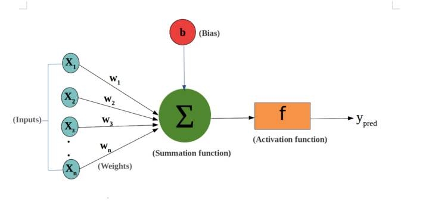
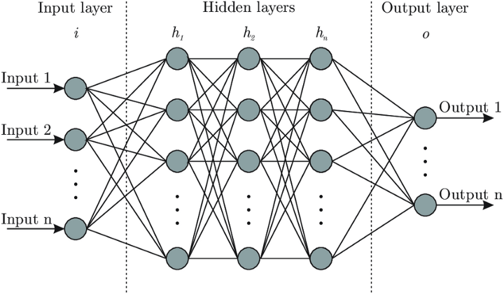

## 神經元計算示意

一個神經元表示，總共有 n 個輸入的變量 $(x_1,...,x_n)$，而每個輸入的變量都有相對應的權重（weights）$(w_1,w_2,...,w_n)$，接下來則會將輸入變量乘上對應的權重值後相加，隨機加上偏差 (Bias)  $b$ 後，將數值放入一個非線性轉換的函數 $f$ 稱作激勵函數 (Activation function)，最後獲得輸出值y。

一個神經元的數學表示式：

$$
y_{pred} = f\left(\sum_{i=1}^n w_i x_i + b\right)
$$

## 神經網路架構

上面的架構為一個神經的運作方式，再將每個神經串連在一起，推廣成類神經網路，則可以用下圖表示。

類神經網路架構共可分為三層，

1. 輸入層：接受資訊，並放入神經網路中，對於資料進行處理後，則會傳遞至下一層
2. 隱藏層：從輸入層或是其他的隱藏層中接收資訊，並分析前一層的輸出、進行處理後，傳遞給下一層
3. 輸出層：輸出層會給予神經網路最後的處理結果，輸出的數值會根據所設定的問題類型而有所不同(分類問題、數值預測)，若為二元分類問題，將只會輸出一個節點(0或1)，若為多分類問題，則可能會輸出多個節點。

以數學的角度理解：我們要做的事就像一個函數，像是給一張圖片，分辨圖片是不是狗。而類神經網路則是一堆函數（即神經元）做 composition 的運算（多層的隱藏層），利用給定的資料，去估計函數的參數（$w_i, b$），擬合出我們要的目標函數。

## RNN

## CNN

## Reference
- [類神經網路(Neural Network)介紹](https://ithelp.ithome.com.tw/articles/10303151)
- 
