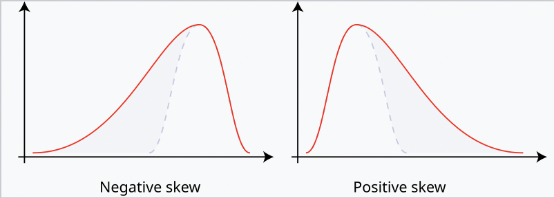

<!-- # 資料偏度處理 -->

在使用檢定方法的時候，都會有資料的假設，像是資料服從常態分布等等。但拿到的資料不一定這麼剛好都符合這些假設，所以要先經過處理才能做檢定。資料的偏度（Skewness）是指資料的分布不對稱，可能會影響統計分析的結果。

<!-- more -->

偏度分為兩種：

- 負偏態或左偏態：左側的尾部更長，分布的主體集中在右側。
- 正偏態或右偏態：右側的尾部更長，分布的主體集中在左側。

如果分布對稱，那麼平均值=中位數，偏度為零（此外，如果分布為單峰分布，那麽平均值=中位數=眾數）。

樣本偏度的計算方式：
$$
\gamma = \frac{m_3}{m_2^{\frac{3}{2}}} = \frac{\frac{1}{n}\sum X_i^3}{(\frac{1}{n}\sum X_i^2)^{\frac{3}{2}}}
$$

## 對數變換 (Log Transformation)

- **適用情況**：主要適用於右偏（正偏）的資料，數據中的值皆為正數。
- **原理**：對數變換會壓縮大值區域，使分布更平衡。
- **方法**：對資料取自然對數或其他基底的對數：
  $$
  X' = \log(X + c)
  $$
  $c$ 是一個常數，用來避免 $X$ 為零的情況（一般取 $c = 1$）。
  

## 平方根變換 (Square Root Transformation)

- **適用情況**：適合於右偏分布，並且資料為非負數。
- **原理**：減少大值的影響，同時保留較小的數值。
- **方法**：對資料取平方根：
  $$
  X' = \sqrt{X + c}
  $$
  $c$ 通常為零或一個小正數。

## 反向變換 (Reciprocal Transformation)

- **適用情況**：適合處理右偏資料，但要求資料為正數。
- **原理**：反向變換將大值壓縮到靠近零的位置，縮小了範圍。
- **方法**：取數據的倒數：
  $$
  X' = \frac{1}{X + c}
  $$
  $c$ 用來避免分母為零的情況。

## 平方或立方根變換 (Square or Cube Root Transformation)

- **適用情況**：適合於左偏（負偏）分布。
- **原理**：對數據進行平方或立方根處理，使數據向右擴展。
- **方法**：將數據轉換為其平方或立方根形式：
  $$
  X' = X^{1/2} \quad \text{or} \quad X' = X^{1/3}
  $$

## Box-Cox 變換

- **適用情況**：適合資料為正值且不確定偏態方向的情況。
- **原理**：Box-Cox 變換是一種參數化變換，通過調整參數 $\lambda$ 來找到最佳的近似常態分布的變換方式。
- **方法**：
  $$
  X' = 
  \begin{cases}
      \frac{X^{\lambda} - 1}{\lambda} & \text{if } \lambda \neq 0 \\
      \log(X) & \text{if } \lambda = 0
  \end{cases}
  $$
  $\lambda$ 值通常通過最大似然估計來確定。

## Yeo-Johnson 變換

- **適用情況**：可用於包含正負值的資料，不像 Box-Cox 變換僅適用於正值。
- **原理**：通過調整參數，使分布更接近常態分布。
- **方法**：
  $$
  X' = 
  \begin{cases}
      \frac{((X + 1)^{\lambda} - 1)}{\lambda} & \text{if } X \geq 0, \lambda \neq 0 \\
      \log(X + 1) & \text{if } X \geq 0, \lambda = 0 \\
      \frac{((1 - X)^{2 - \lambda} - 1)}{2 - \lambda} & \text{if } X < 0, \lambda \neq 2 \\
      -\log(1 - X) & \text{if } X < 0, \lambda = 2
  \end{cases}
  $$

